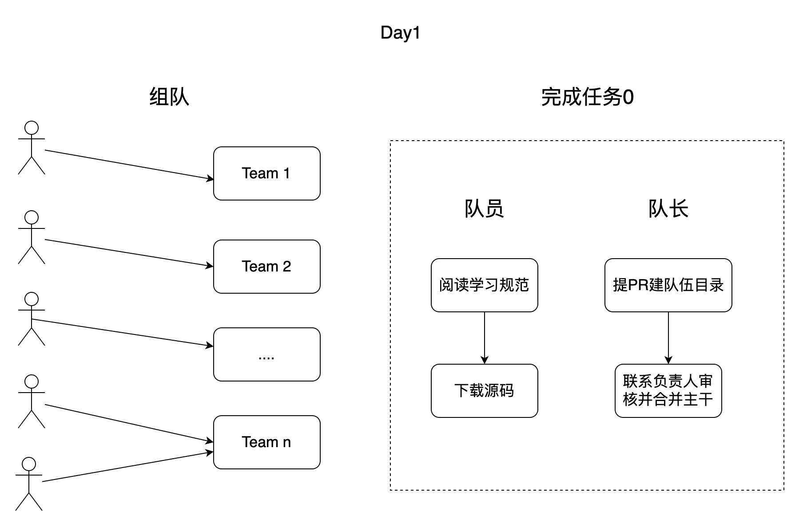
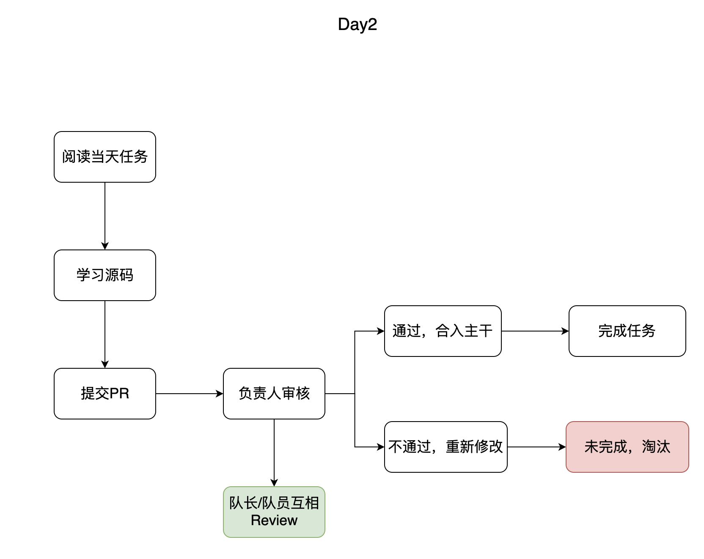

### 1.源码

地址：https://github.com/gcc-mirror/gcc/tree/releases/gcc-4.9

### 2.任务

一起组队共读STL容器，请阅读上述源码，完成下面任务。

|  编号    |   任务   |    时间  |
| ---- | ---- | ---- |
| 1 | [小试牛刀-list](https://github.com/gcc-mirror/gcc/blob/releases/gcc-9/libstdc%2B%2B-v3/include/bits/stl_list.h) | 1天 |
| 2 | [面试必备-vector](https://github.com/gcc-mirror/gcc/blob/releases/gcc-9/libstdc%2B%2B-v3/include/bits/stl_vector.h) | 1天 |
| 3 | buffer 思考与代码改进 | 1天 |
| 4 | [红黑树-rb_tree](https://github.com/gcc-mirror/gcc/blob/releases/gcc-9/libstdc%2B%2B-v3/include/bits/stl_tree.h) | 2天  |
| 5 | [刷题开发-map](https://github.com/gcc-mirror/gcc/blob/releases/gcc-9/libstdc%2B%2B-v3/include/bits/stl_map.h) | 1天 |
| 6 | buffer 思考与代码改进 | 1天 |
| 7 | [放松环节-使用vector+list+map造一个案例场景](./example/README.md) | 1天 |
| 8 | [迭代器-iterator](https://github.com/gcc-mirror/gcc/blob/releases/gcc-9/libstdc%2B%2B-v3/include/bits/stl_iterator_base_types.h) | 1天 |
| 9 | [哈希表-HashTable](https://github.com/gcc-mirror/gcc/blob/releases/gcc-9/libstdc%2B%2B-v3/include/bits/hashtable.h) | 2天 |
| 10 | buffer 思考与代码改进 | 1天 |
| 11 | [双端队列-Deque](https://github.com/gcc-mirror/gcc/blob/releases/gcc-9/libstdc%2B%2B-v3/include/bits/stl_deque.h) | 1天 |
| 12 | [放松环节-手写一个iterator、hashtable、deque]() | 1天 |
| 13 | 总结与回顾 | 1天 |

### 3.如何做

### 4.规范

### 4.1 代码规范

提交的代码需要严格遵循google c++规范，见：

> https://google.github.io/styleguide/cppguide.html

队友/队长/负责人Review代码时，需要对代码提出建议。

### 4.2 commit规范

请阅读[commit.md](./rules/commit.md)

### 4.3 分支规范

请阅读[branch.md](./rules/branch.md)

### 4.4 pr规范

请阅读[pr.md](./rules/pr.md)
