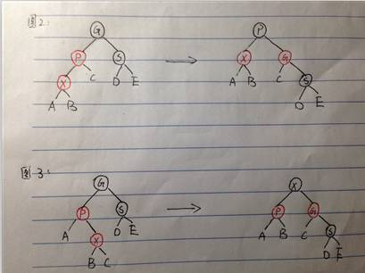
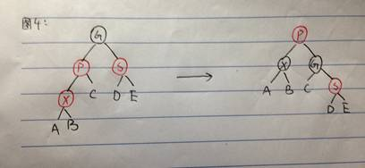
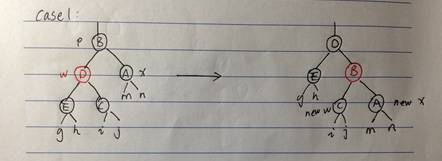
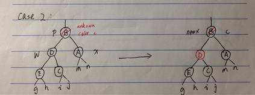
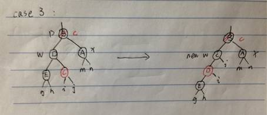
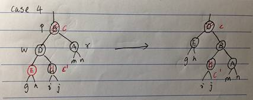

## task_3 rb_tree

### 红黑树的概念
红黑树在二叉搜索树的基础上增加一个存储位置用来存储节点的颜色，每个节点不是red就是black；红黑树直接控制的是节点的颜色（红/黑）,
间接控制树的最长路径不超过最短路径的二倍，从而实现接近平衡

### 红黑树的性质
* 根节点是黑色
* 如果一个节点是红色，那么它的孩子节点都是黑色
* 对于每个节点，从该节点到其所有后代叶子节点的简单路径上，均包含相同数目的黑色节点。
* 每个叶子节点的都是黑色的，叶子节点指的是空（`nullptr`）

### 红黑树的插入

* 情况1：插入空树中，插入的节点是根节点 
>对于第一种情况：插入后将根节点再染成黑色即可。
* 情况2：插入的节点的父亲是黑色的
>对于第二种情况：直接插入依然满足性质。首先设X是新增节点，P是其父节点，S是其父节点的兄弟节点，G是其的祖父节点。
* 情况3：插入的节点的父亲是红色的，而父节点的兄弟为黑色，且插入节点为外部节点（要找到它要么一直遍历做节点，要么一直遍历右节点）
>对于第三种情况：我们可以通过对P进行右旋和节点的重新着色对树进行修复（应对三、四两种情况我们的着色方式都是：在旋转前先将要旋转的根节点染红，然后旋转，最后将新的根节点染黑）见下图2。
* 情况4：插入的节点的父亲是红色的，而父节点的兄弟为黑色，且插入节点为内部节点（不是外外部节点的节点）
>对于第四种情况：亦是如此，只不过我们需要两次旋转，先对P做左旋再对G做右旋，并重新着色，见下图3。

* 情况5：插入的节点的父亲是红色的，而父节点的兄弟也是红色的
>对于第五种情况：我们如果按照三四两种情况的修复方式是无法满足性质的，我们就考虑旋转后将新的根节点染红，未插入之前的父节点的兄弟节点染红，新根节点的孩子节点染黑。
这样出现的问题是新根节点的父节点可能是红的。此时，我们只能向着根的方向逐步过滤这种情况，不再有连续的两个红色节点或遇到根节点为止（把根重染成黑色）。
这种策略自底向上，逐步递归完成，见下面的“图4”。

### 红黑树的删除

首先我们可以将情况分为两类，即当前节点是其父节点的右节点或左节点，他们是对称的，只需要对一种情况进行详细讨论，另一种情况也就是以此类推了。
一般的资料都是对当前节点x是做节点的情况进行分析，在这里我们就先对x是右节点的情况一一画图进行分析。
这里先对图中的标记进行解释：x表示当前节点，w表示当前节点的，p表示x的父节点，c表示某个确定的颜色（可能是红，也可能是黑，就看实际情况了）
对应于逻辑中的存在，c'表示任意颜色（才不管你是什么颜色咧，对讨论无影响）对应于逻辑中的任意。

#### 情况1：
当前节点x的兄弟w是红色的。这种情况我们可以确定x的父节点为黑色，w的两个孩子为黑。如图所示，我们先对p染红，再将w染黑，然后对p进行一次右旋，红黑性质得以保持。
而这时新的兄弟节点是黑色的，进而可以将情况一转换成情况2、3、4中的一种。

#### 情况2：
当前节点x的兄弟节点w是黑色的，且w的两个孩子都是黑色的。这种情况我们无法确定父节点p的颜色，所以其颜色标记为c，情况3、4同。
在这个情况下，我们可以将x、w同时去掉一层黑色，将这一层黑色指向根节点p，p变成新的当前节点x。此时如果该标记颜色c为红色，则可以将节点染成黑色，
此时指针x的那一层黑色被去掉，同时红黑性质得到满足，调整完毕；如果c为黑色，则需要对新的当前节点x的情况进行处理，直到调整完毕。

#### 情况3：
当前节点x的兄弟节点为黑色，且w的左孩子是黑色，右孩子是红色的。在这种情况下，我们将w和其右孩子的颜色交换，并对w进行左转，红黑性质得以保持。此时已将情况3转换成情况4。

#### 情况4：
当前节点x的兄弟节点w为黑色，且w的左孩子是红的，有孩子可以为任意颜色。将p的颜色赋给w，然后将p，和w的左节点染黑，并对p做右旋转。
这是可以去掉x的额外的黑色，而且可以保持红黑性质。最后将树的根赋给x后，调整结束。

我们发现，情况1、3、4最多经过三次旋转调整就可以结束。情况二在最坏的情况下一直向上推最多也是树的层数log(n),这就是红黑树删除操作的性能优势。