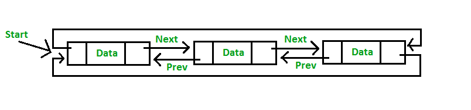

# Task1: STL List学习笔记

## 介绍

stl_list是一个双向循环链表，相对于vector而言，能实现O(1)的插入和删除的效果。



打开[代码](https://github.com/gcc-mirror/gcc/blob/releases/gcc-9/libstdc++-v3/include/bits/stl_list.h)发现很多宏定义，大部分宏定义都在[c++config](libstdc++-v3/include/bits/c++config)中定义了。

## 宏

宏主要是用来简化代码，在这里挑两个有有意思的聊一聊。

### __cplusplus

`__cplusplus` 是一个预定义宏，通常被定义为一个整数，用来表示编译器对C++标准的支持程度。

* C++98标准之前，`__cplusplus`的值为1
* C++98标准中，`__cplusplus`的值为199711L
* C++11标准中，`__cplusplus`的值为201103L
* C++14标准中，`__cplusplus`的值为201402L
* C++17标准中，`__cplusplus`的值为201703L
* C++20标准中，`__cplusplus`的值为202002L

一些常用的方式：

* 你可以通过这个值来判断是否支持C++

```cpp
#if __cplusplus
    // C++ code
#else
    // C code
#endif
```

* 区分C和C++

```cpp  
#ifdef __cplusplus
    extern "C" {
#endif

// C code

#ifdef __cplusplus
    }
#endif

```

这样就可以在C++中使用C的代码了。

* 通过这个宏，可以在代码中根据不同的C++标准来编写不同的代码。

```cpp
#if __cplusplus >= 201103L
    // C++11 code
#else
    // C++98 code
#endif
```

### _GLIBCXX_VISIBILITY

`_GLIBCXX_VISIBILITY` 是一个宏，用来控制符号的可见性，这个宏的值为`default`或者`hidden`。

* 如果为`default`，则符号可见
* 如果为`hidden`，则符号不可见


## 结构

快速翻了下[代码](https://github.com/gcc-mirror/gcc/blob/releases/gcc-9/libstdc++-v3/include/bits/stl_list.h), 从代码中大概能看到如下几个主要主程部分：

### _List_node_base

基础类，不包括数据，只含有前后指针

```cpp
struct _List_node_base {
  _List_node_base* _M_next;
  _List_node_base* _M_prev;
}
```

### _List_node

基于_List_node_base的节点，包含了`_Tp`类型的数据
    
```cpp
template<typename _Tp>
struct _List_node : public _List_node_base
```

### _List_iterator

List 的迭代器

```cpp
template<typename _Tp> struct _List_iterator
```

## 常用方法

 成员函数|功能
--------------| --------------
begin()|	返回指向容器中第一个元素的双向迭代器。
end()|	返回指向容器中最后一个元素所在位置的下一个位置的双向迭代器。
rbegin()|	返回指向最后一个元素的反向双向迭代器。
rend()|	返回指向第一个元素所在位置前一个位置的反向双向迭代器。
cbegin()	|和 begin() 功能相同，只不过在其基础上，增加了 const 属性，不能用于修改元素。
cend()|	和 end() 功能相同，只不过在其基础上，增加了 const 属性，不能用于修改元素。
crbegin() |	和 rbegin() 功能相同，只不过在其基础上，增加了 const 属性，不能用于修改元素。
crend()|	和 rend() 功能相同，只不过在其基础上，增加了 const 属性，不能用于修改元素。
empty()	|判断容器中是否有元素，若无元素，则返回 true；反之，返回 false。
size()|	返回当前容器实际包含的元素个数。
max_size()|	返回容器所能包含元素个数的最大值。这通常是一个很大的值，一般是 232-1，所以我们很少会用到这个函数。
front()|	返回第一个元素的引用。
back()	|返回最后一个元素的引用。
assign()|	用新元素替换容器中原有内容。
emplace_front()|	在容器头部生成一个元素。该函数和 push_front() 的功能相同，但效率更高。
push_front()|	在容器头部插入一个元素。
pop_front()|	删除容器头部的一个元素。
emplace_back()|	在容器尾部直接生成一个元素。该函数和 push_back() 的功能相同，但效率更高。
push_back()	|在容器尾部插入一个元素。
pop_back()|	删除容器尾部的一个元素。
emplace()|	在容器中的指定位置插入元素。该函数和 insert() 功能相同，但效率更高。
insert() |	在容器中的指定位置插入元素。
erase()	|删除容器中一个或某区域内的元素。
swap()	|交换两个容器中的元素，必须保证这两个容器中存储的元素类型是相同的。
resize()|	调整容器的大小。
clear()	|删除容器存储的所有元素。
splice()	|将一个 list 容器中的元素插入到另一个容器的指定位置。
remove(val)	|删除容器中所有等于 val 的元素。
remove_if()|	删除容器中满足条件的元素。
unique()	|删除容器中相邻的重复元素，只保留一个。
merge()	|合并两个事先已排好序的 list 容器，并且合并之后的 list 容器依然是有序的。
sort()	|通过更改容器中元素的位置，将它们进行排序。
reverse()|	反转容器中元素的顺序。

## 使用

### 创建

使用下述语法创建一个list
```cpp
std::list <data-type> name_of_list;
```

如：创建一个int类型的list
```cpp
std::list<int> numbers;
```

### 迭代

通过迭代器遍历list

```cpp
#include <iostream>
#include <list>

int main() {
  std::list<int> numbers;

  numbers.push_back(1);
  numbers.push_back(2);

  std::list<int>::iterator it;
  for (it = numbers.begin(); it != numbers.end(); ++it) {
    std::cout << *it << std::endl;
  }
}

```

其他的方法省略，可以参考[这里](https://www.geeksforgeeks.org/list-cpp-stl/)。

## 演示

我们尝试来做点有意思的事情: 查询股票最后一个交易日的1分钟K线数据，数据来源于上海交易所官网。

基本思路如下：
* 程序接收股票代码
* 如果代码合法，请求上交所官网，获取股票最后一个交易日的分钟K线数据
* 对数据进行处理，处理成合法的JSON格式
* 解析JSON数据，获取K线数据列表
* 创建一个List<Stock>，将K线数据列表存入List中
* 打印结果供查看演示结果是否正确

### 定义结构

包含K线数据结果和操作股票的类

```cpp
#ifndef STOCK_H
#define STOCK_H

#include <iostream>
#include <list>

struct StockData {
  int64_t time;
  double open;
  double high;
  double low;
  double close;
  double volume;
  double amount;
};

class Stock {
 public:
  Stock(const std::string& code);

  // 获取股票最后一个交易日的分钟K线数据
  std::string GetData();

  // 解析JSON数据，获取K线数据列表
  std::list<StockData> ParseData(std::string& data);

  // 打印结果
  void PrintData(const std::list<StockData>& stocks);

  // 处理数据
  std::string HandleData(std::string& data);

 private:
  // 股票代码
  std::string code;
};

#endif

```

### 方法实现

```cpp
#include <iostream>

#include "httplib.h"
#include "simdjson.h"
#include "stock.h"

// 使用股票代码初始化
Stock::Stock(const std::string& code) { this->code = code; };

// 获取股票最后一个交易日的分钟K线数据
std::string Stock::GetData() {
  std::string fields = "time,price,volume,avg_price,amount,highest,lowest";

  // 创建 HTTP 客户端
  httplib::Client cli("yunhq.sse.com.cn", 32041);

  // 发送请求
  auto res = cli.Get("/v1/sh1/line/" + this->code +
                     "?callback=&select=" + fields + "&_=1687183788521");

  // 如果请求成功，打印结果
  if (res && res->status == 200) {
    return res->body;
  } else {
    std::cout << "error code: " << res->status << std::endl;
    return "{}";
  }
}

// 解析JSON数据，获取K线数据列表
std::list<StockData> Stock::ParseData(std::string& data) {
  auto res_body_padded = simdjson::padded_string(this->HandleData(data));

  // 解析 string 为 json
  simdjson::ondemand::parser parser;
  simdjson::ondemand::document json = parser.iterate(res_body_padded);
  std::list<StockData> values;

  // 获取json中的line数组，并遍历
  for (auto line : json["line"].get_array()) {
    auto item = line.get_array();
    // 获取K线时间
    // int64_t time = item.at(0).get_int64();
    // times.push_back(time);

    // 获取当前价格
    StockData stock_data = StockData();
    stock_data.close = item.at(1).get_double();
    values.push_back(stock_data);

    // 获取成交量
    // std::cout << "volume: " << item.at(2) << std::endl;
    // 获取均价
    // std::cout << "avg_price: " << item.at(3) << std::endl;
    // 获取成交额
    // std::cout << "amount: " << item.at(4) << std::endl;
    // 获取最高价
    // std::cout << "highest: " << item.at(5) << std::endl;
    // 获取最低价
    // std::cout << "lowest: " << item.at(6) << std::endl;
  }

  return values;
}

// 打印结果
void Stock::PrintData(const std::list<StockData>& stocks) {
  for (auto stock : stocks) {
    std::cout << "price: " << stock.close << std::endl;
  }
}

// 处理数据
std::string Stock::HandleData(std::string& data) {
  if (data != "{}") {
    int data_size = data.size();
    std::string res_body = data.erase(0, 1).erase(data_size - 2, data_size - 1);
    return res_body;
  }

  return "{}";
}
```

### 调用测试

编写测试代码调用上诉方法，测试是否正常工作。

```cpp
#include <iostream>
#include <list>

#include "httplib.h"
#include "simdjson.h"
#include "stock.h"

/**
 * @brief 从上海证券交易所获取股票1分钟K线数据
 * @author Martin
 *
 * @return int
 */
int main(int argc, char** argv) {
  if (argc == 1) {
    std::cout << "Usage: " << argv[0] << " [code]" << std::endl;
  } else {
    for (int i = 1; i < argc; ++i) {
      std::string code = argv[i];
      if (code.length() != 6) {
        std::cout << "Invalid code: " << code << std::endl;
      } else {
        Stock stock(code);
        std::string data = stock.GetData();
        std::list<StockData> stocks = stock.ParseData(data);
        stock.PrintData(stocks);
      }
    }
  }

  return 0;
}

```

### 编译并运行程序

编译程序

```bash
 g++ -std=c++11 -o build/task_1 src/task_1/main.cpp src/task_1/simdjson.cpp src/task_1/stock.cpp
 ```

运行程序

```bash
./build/task_1 600600
```

你会看到类似如下的输出


```bash
price: 105.66
price: 105
price: 105.52
price: 105.29
price: 105.14
price: 105.46
price: 105.85
price: 105.92
price: 105.87
price: 106.32
price: 106.05
...

```

以上演示程序为简单（偷懒）只打印了股票的价格，其他属性可自行修改，部分代码已经放在注释中了。另外，很多异常情况没有做错误处理，实际开发中，需要对各种异常情况进行处理，比如：股票代码不合法，网络请求失败，JSON解析失败等等。

----
Enjoy! :smile:

