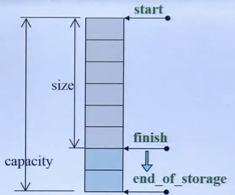

# Task2: STL Vector学习笔记

## Vector 介绍

`vector`是一种动态数组，维护的是一个线性空间。同`array`相比，`array`为静态数组，创建了就不能改变大小，如果需要改变则需要重新创建。而`vector`的优点是会随着元素的增加而自行扩容空间。

`vector`扩容空间以原大小的两倍另外配置一块较大的空间，将内容拷贝过来，然后才开始在原内容之后构造新元素，并释放原空间。

## Vector 数据结构

`vector`继承自`_Vector_base`，其中`_Vector_impl_data`有三个关键的指针成员变量，`_M_start`，`_M_finish`，`_M_end_of_storage`：

```cpp
  template<typename _Tp, typename _Alloc>
    struct _Vector_base
    {
      struct _Vector_impl_data
      {
	pointer _M_start;
	pointer _M_finish;
	pointer _M_end_of_storage;
  ```

* _M_start指向容器的头部
* _M_finish指向容器的尾部
* _M_end_of_storage指向容器的尾部

如下图所示：



* 图片来源: [C++ STL vector容量大小的变化](https://blog.csdn.net/hrbust_cxl/article/details/131211709)


## Vector 构造函数

* 默认构造函数

```cpp
vector<int> items;
```

 这种情况下，`vector`大小为零，为了节约内存空间，`vector<int>`不会主动申请内存、创建缓冲区。

* 指定大小的构造函数

```cpp
vector<int> items(10, 0);
```

这种情况下，`_Vector_base`首先使用`_Alloc`类型的内存分配器分配`n*sizeof(Tp)`的内存，然后在`vector`构造函数中填充初始值

```cpp
vector(size_type __n, const allocator_type& __a = allocator_type())
      : _Base(_S_check_init_len(__n, __a), __a)
      { _M_default_initialize(__n); }

_M_default_initialize(size_type __n)
  {
  	this->_M_impl._M_finish =
	    std::__uninitialized_default_n_a(this->_M_impl._M_start, __n,
					   _M_get_Tp_allocator());
  }

_Vector_base(size_t __n, const _Alloc&)
    : _M_start(0), _M_finish(0), _M_end_of_storage(0) 
  {
    _M_start = _M_allocate(__n);
    _M_finish = _M_start;
    _M_end_of_storage = _M_start + __n;
  }
	
```


* 拷贝构造函数

```cpp
vector<int> items(10, 0);
vector<int> items2(items);
```

首先使用`_Alloc`类型的内存分配器分配`n*sizeof(Tp)`的内存，然后在`vector`构造函数中填充初始值

```cpp
vector(const vector& __x)
      : _Base(__x.size(),
	_Alloc_traits::_S_select_on_copy(__x._M_get_Tp_allocator()))
      {
	this->_M_impl._M_finish =
	  std::__uninitialized_copy_a(__x.begin(), __x.end(),
				      this->_M_impl._M_start,
				      _M_get_Tp_allocator());
      }
```

* 从迭代器范围构造

```cpp
vector<int> items(10, 0);
vector<int> items2(items.begin(), items.end());
```

首先使用`_Alloc`类型的内存分配器分配`n*sizeof(Tp)`的内存，然后在`vector`构造函数中填充初始值

```cpp
template<typename _InputIterator>
	vector(_InputIterator __first, _InputIterator __last,
	       const allocator_type& __a = allocator_type())
	: _Base(__a)
	{
	  // Check whether it's an integral type.  If so, it's not an iterator.
	  typedef typename std::__is_integer<_InputIterator>::__type _Integral;
	  _M_initialize_dispatch(__first, __last, _Integral());
	}
```

## Vector 接口函数


名称| 说明
--------------| --------------
assign	| 清除矢量并将指定的元素复制到该空矢量。
at	| 返回对矢量中指定位置的元素的引用。
back	| 返回对向量中最后一个元素的引用。
begin	| 对该向量中第一个元素返回随机访问迭代器。
capacity	| 返回在不分配更多的存储的情况下向量可以包含的元素数。
cbegin | 	返回指向向量中第一个元素的随机访问常量迭代器。
cend	|  返回一个随机访问常量迭代器，它指向刚超过矢量末尾的位置。
crbegin	|  返回一个指向反向矢量中第一个元素的常量迭代器。
crend	|  返回一个指向反向矢量末尾的常量迭代器。
clear|  	清除向量的元素。
data	|  返回指向向量中第一个元素的指针。
emplace	|  将就地构造的元素插入到指定位置的向量中。
emplace_back|  	将一个就地构造的元素添加到向量末尾。
empty	|  测试矢量容器是否为空。
end	|  返回指向矢量末尾的随机访问迭代器。
erase	|  从指定位置删除向量中的一个元素或一系列元素。
front	|  返回对向量中第一个元素的引用。
get_allocator | 	将对象返回到矢量使用的 allocator 类。
insert	|  将一个元素或多个元素插入到指定位置的向量中。
max_size | 	返回向量的最大长度。
pop_back | 	删除矢量末尾处的元素。
push_back	|  在矢量末尾处添加一个元素。
rbegin	|  返回指向反向向量中第一个元素的迭代器。
rend	|  返回一个指向反向矢量末尾的迭代器。
reserve	|  保留向量对象的最小存储长度。
resize	|  为矢量指定新的大小。
shrink_to_fit | 	放弃额外容量。
size	 |  返回向量中的元素数量。
swap	|  交换两个向量的元素。


* push_back

我们以push_back为例，一起来看看vector的内部实现

```cpp
 void
      push_back(const value_type& __x)
      {
	if (this->_M_impl._M_finish != this->_M_impl._M_end_of_storage)
	  {
	    _GLIBCXX_ASAN_ANNOTATE_GROW(1);
	    _Alloc_traits::construct(this->_M_impl, this->_M_impl._M_finish,
				     __x);
	    ++this->_M_impl._M_finish;
	    _GLIBCXX_ASAN_ANNOTATE_GREW(1);
	  }
	else
	  _M_realloc_insert(end(), __x);
      }

```
如果内存还没有写满时，把元素直接插入成员变量`_M_finish`所指向的位置，如果已经写满了，会调用`vector`的成员函数`_M_realloc_insert`。

该方法在 [libstdc++-v3/include/bits/vector.tcc](https://github.com/gcc-mirror/gcc/blob/master/libstdc++-v3/include/bits/vector.tcc#L123) 中。

```cpp
#if __cplusplus >= 201103L
  template<typename _Tp, typename _Alloc>
    template<typename... _Args>
      _GLIBCXX20_CONSTEXPR
      void
      vector<_Tp, _Alloc>::
      _M_realloc_insert(iterator __position, _Args&&... __args)
#else
  template<typename _Tp, typename _Alloc>
    void
    vector<_Tp, _Alloc>::
    _M_realloc_insert(iterator __position, const _Tp& __x)
#endif
    {
      const size_type __len = _M_check_len(1u, "vector::_M_realloc_insert");
      pointer __old_start = this->_M_impl._M_start;
      pointer __old_finish = this->_M_impl._M_finish;
      const size_type __elems_before = __position - begin();
      pointer __new_start(this->_M_allocate(__len));
      pointer __new_finish(__new_start);

      // RAII guard for allocated storage.
      struct _Guard
      {
	pointer _M_storage;	    // Storage to deallocate
	size_type _M_len;
	_Tp_alloc_type& _M_alloc;

	_GLIBCXX20_CONSTEXPR
	_Guard(pointer __s, size_type __l, _Tp_alloc_type& __a)
	: _M_storage(__s), _M_len(__l), _M_alloc(__a)
	{ }

	_GLIBCXX20_CONSTEXPR
	~_Guard()
	{
	  if (_M_storage)
	    __gnu_cxx::__alloc_traits<_Tp_alloc_type>::
	      deallocate(_M_alloc, _M_storage, _M_len);
	}

      private:
	_Guard(const _Guard&);
      };
      _Guard __guard(__new_start, __len, _M_impl);

      // The order of the three operations is dictated by the C++11
      // case, where the moves could alter a new element belonging
      // to the existing vector.  This is an issue only for callers
      // taking the element by lvalue ref (see last bullet of C++11
      // [res.on.arguments]).

      // If this throws, the existing elements are unchanged.
#if __cplusplus >= 201103L
      _Alloc_traits::construct(this->_M_impl,
			       std::__to_address(__new_start + __elems_before),
			       std::forward<_Args>(__args)...);
#else
      _Alloc_traits::construct(this->_M_impl,
			       __new_start + __elems_before,
			       __x);
#endif

#if __cplusplus >= 201103L
      if _GLIBCXX17_CONSTEXPR (_S_use_relocate())
	{
	  // Relocation cannot throw.
	  __new_finish = _S_relocate(__old_start, __position.base(),
				     __new_start, _M_get_Tp_allocator());
	  ++__new_finish;
	  __new_finish = _S_relocate(__position.base(), __old_finish,
				     __new_finish, _M_get_Tp_allocator());
	}
      else
#endif
	{
	  // RAII type to destroy initialized elements.
	  struct _Guard_elts
	  {
	    pointer _M_first, _M_last;  // Elements to destroy
	    _Tp_alloc_type& _M_alloc;

	    _GLIBCXX20_CONSTEXPR
	    _Guard_elts(pointer __elt, _Tp_alloc_type& __a)
	    : _M_first(__elt), _M_last(__elt + 1), _M_alloc(__a)
	    { }

	    _GLIBCXX20_CONSTEXPR
	    ~_Guard_elts()
	    { std::_Destroy(_M_first, _M_last, _M_alloc); }

	  private:
	    _Guard_elts(const _Guard_elts&);
	  };

	  // Guard the new element so it will be destroyed if anything throws.
	  _Guard_elts __guard_elts(__new_start + __elems_before, _M_impl);

	  __new_finish = std::__uninitialized_move_if_noexcept_a(
			   __old_start, __position.base(),
			   __new_start, _M_get_Tp_allocator());

	  ++__new_finish;
	  // Guard everything before the new element too.
	  __guard_elts._M_first = __new_start;

	  __new_finish = std::__uninitialized_move_if_noexcept_a(
			    __position.base(), __old_finish,
			    __new_finish, _M_get_Tp_allocator());

	  // New storage has been fully initialized, destroy the old elements.
	  __guard_elts._M_first = __old_start;
	  __guard_elts._M_last = __old_finish;
	}
      __guard._M_storage = __old_start;
      __guard._M_len = this->_M_impl._M_end_of_storage - __old_start;

      this->_M_impl._M_start = __new_start;
      this->_M_impl._M_finish = __new_finish;
      this->_M_impl._M_end_of_storage = __new_start + __len;
    }
```

根据以上代码，我们知道Vector插入新空间元素的流程如下：

* 申请新的内存空间，大小为当前空间的两倍。如果第一次插入，则申请一个元素大小的空间，后续如果超出容器所申请的空间，则在之前基础上乘以2，然后申请新的内存空间
* 把待插入的元素插入到相应的位置
* 把原来旧内存中元素全部拷贝到新的内存中来
* 调用旧内存中所有元素的析构，并销毁旧的内存

## Vector 演示

这里我们通过Vector来实现一个观察者模式[Observer Pattern](https://en.wikipedia.org/wiki/Observer_pattern)。

首先我们分别定义一个观察者`Obsever`和一个被观察者`Subject`

```cpp
#ifndef OBSERVER_H
#define OBSERVER_H
#include <vector>

// 因为在Observer中有引用，所以先申明
class Subject;

// 观察者
class Observer {
 public:
  // 使用Subject初始化Observer  
  Observer(Subject* subject);
  // 从Subject移除自己
  void removeObserver();
  // 如果Subject发生变化，会调用这个方法
  void notify();

 protected:
  // Subject instance
  Subject& subject_;

  // 演示用
  //  参考代码：https://refactoringguru.cn/design-patterns/observer/cpp/example
  int number_;
  static int static_number_;
};

// 被观察者
class Subject {
 public:
  // 注册观察者，或者使用`Observer(Subject* subject)`来attach
  void registerObserver(Observer* o);
  // 移除观察者
  void removeObserver(Observer* o);
  // 通知所有观察者
  void notifyObservers();

  //  演示用
  void setState(int state);
  int getState();

 protected:
  // 观察者列表
  std::vector<Observer*> observers_;

  int state_ = 0;
};
#endif
```

然后实现它们的逻辑

```cpp
#include "observer.h"

#include <iostream>

void Subject::registerObserver(Observer* o) { observers_.push_back(o); }

void Subject::removeObserver(Observer* o) {
  for (auto it = observers_.begin(); it != observers_.end(); ++it) {
    if (*it == o) {
      observers_.erase(it);
      break;
    }
  }
}

void Subject::setState(int state) {
  state_ = state;
  // 演示用
  // 自动调用notifyObservers
  notifyObservers();
}

int Subject::getState() { return state_; }

void Subject::notifyObservers() {
  for (auto it = observers_.begin(); it != observers_.end(); ++it) {
    (*it)->notify();
  }
}

Observer::Observer(Subject* subject) : subject_(*subject) {
  Observer::static_number_++;
  subject_.registerObserver(this);
  this->number_ = Observer::static_number_;

  std::cout << "Observer " << this->number_ << " Created" << std::endl;
}

void Observer::removeObserver() {
  subject_.removeObserver(this);
  std::cout << "Observer " << this->number_ << " Removed" << std::endl;
}

void Observer::notify() {
  std::cout << "Observer " << this->number_ << " notified" << std::endl;
  std::cout << "\tSubject state: " << subject_.getState() << std::endl;
}
```

调用测试

```cpp
#include "observer.h"

//  演示用
int Observer::static_number_ = 0;

int main() {
  Subject* subject = new Subject();
  Observer* observer1 = new Observer(subject);
  Observer* observer2 = new Observer(subject);

  subject->setState(1);
  subject->setState(2);

  observer1->removeObserver();

  subject->setState(3);

  return 0;
}
```