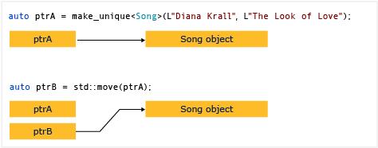
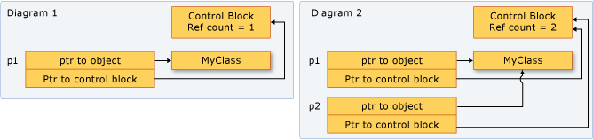

# 智能指针学习笔记

**Note:** 


1. 本文是学习智能指针的学习笔记，有部分内容来自于或者改编自MSDN。
2. 部分概念性的知识点，由Copilot自动生成，可能存在错误，需要人工修正。

-----


C++ 11 引入了三个智能指针

* std::unique_ptr<T> ：独占资源所有权的指针。
* std::shared_ptr<T> ：共享资源所有权的指针。
* std::weak_ptr<T> ：共享资源的观察者，需要和 std::shared_ptr 一起使用，不影响资源的生命周期。

~~std::auto_ptr 已被废弃。~~

## 裸指针

裸指针在使用后需要手工释放。

```cpp
Welcome* welcome = new Welcome("Zhang San");
delete welcome;
```

## 智能指针

### 智能指针简介

智能指针是在`<memory>`std命名空间中定义的模板类，指向原始资源指针。它的实例对象的行为类似于指针，它的行为更像一个类对象，它可以自动释放所指向的对象，避免了手工释放的问题。

```cpp
std::unique_ptr<Welcome> welcome(new Welcome("Zhang San"));
```

在智能指针中，通过重载了->和*运算符，使得智能指针的行为类似于裸指针。

```cpp
std::unique_ptr<Welcome> welcome(new Welcome("Zhang San"));
welcome->sayHello();
(*welcome).sayHello();
```

**注意：** 智能指针的对象在离开作用域时，会自动释放所指向的对象。

```cpp
{
    std::unique_ptr<Welcome> welcome(new Welcome("Zhang San"));
    welcome->sayHello();
}// welcome对象离开作用域，自动释放所指向的对象
```

智能指针的设计原则是在内存和性能上尽可能高效，所以它的实现是非常精简的，它的实现原理是通过引用计数来实现的。可以通过 `use_count()` 方法来查看当前指针的引用计数。

```cpp
#include <iostream>
#include <memory>

class Welcome {
 public:
  Welcome(std::string name) : name_(name) {
    std::cout << "Welcome " << name_ << std::endl;
  }
  ~Welcome() { std::cout << "Goodbye " << name_ << std::endl; }

 private:
  std::string name_;
};

int main() {
  std::shared_ptr<Welcome> welcome(new Welcome("Zhang San"));
  std::cout << welcome.use_count() << std::endl;
  {
    std::shared_ptr<Welcome> welcome2 = welcome;
    std::cout << welcome.use_count() << std::endl;
  } // 释放welcome2

  std::cout << welcome.use_count() << std::endl;

  return 0;
}
```

输出如下的内容

```bash
Welcome Zhang San
1
2
1
Goodbye Zhang San
```

我们看到每增加一次引用，`count` + 1，每减少一次引用，`count` - 1。当 `}` 作用域结束时，`welcome2`对象被释放，所以`count` - 1，当`count`为0时，自动释放所指向的对象。

智能指针同时提供了直接访问原始指针的方式，可以通过 `get()` 方法来获取原始指针。

```cpp
std::shared_ptr<Welcome> welcome(new Welcome("Zhang San"));
Welcome* welcome_ptr = welcome.get();

doSomething(welcome_ptr);
```

**注意：** 
1. 通过 `get()` 方法获取的原始指针，不要使用 `delete` 来释放，因为智能指针会自动释放所指向的对象，如果使用 `delete` 来释放，会导致重复释放的问题。
2. 通过 `get()` 方法获取的原始指针，不要使用 `shared_ptr`、 `weak_ptr`  来初始化，因为这样会导致引用计数错误，从而导致重复释放的问题。
3. 不要在参数列表中动态创建智能指针，而是始终在单独的语句中创建智能指针，然后再传递给函数。


部分标注库的智能指针中提供了释放指针的方法，如 `reset()` 方法，可以通过 `reset()` 方法来释放指针。

```cpp
std::shared_ptr<Welcome> welcome(new Welcome("Zhang San"));
welcome.reset();
```

这将在范围结束之前释放指针，这样可以避免在范围结束时，智能指针自动释放指针，从而导致重复释放的问题。

### 智能指针的使用

#### 1. 作为函数的返回值

```cpp
std::shared_ptr<Welcome> createWelcome() {
  std::shared_ptr<Welcome> welcome(new Welcome("Zhang San"));
  return welcome;
}
```

#### 2. 作为函数的参数

```cpp
void doSomething(std::shared_ptr<Welcome> welcome) {
  welcome->sayHello();
}
```

#### 3. 作为类的成员

```cpp
class Person {
 private:
  std::string name_;
  std::shared_ptr<Car> car_;
};
```


### 智能指针的循环引用

智能指针的循环引用是指两个或多个智能指针相互引用，从而导致引用计数无法为0，从而导致内存泄漏的问题。

```cpp
class Person {
 private:
  std::string name_;
  std::shared_ptr<Car> car_;
};

class Car {
 private:
  std::string name_;
  std::shared_ptr<Person> person_;
};
```

在上面的代码中，`Person` 类中包含了一个 `Car` 类的智能指针，`Car` 类中包含了一个 `Person` 类的智能指针，这样就导致了循环引用的问题。

解决循环引用的问题，可以使用 `weak_ptr` 来解决。

```cpp
class Person {
 private:
  std::string name_;
  std::weak_ptr<Car> car_;
};

class Car {
 private:
  std::string name_;
  std::weak_ptr<Person> person_;
};
```

* `weak_ptr` 是一种弱引用，它不会增加引用计数，所以它不会导致循环引用的问题。

### 智能指针的线程安全

智能指针的线程安全是指多个线程同时访问同一个智能指针时，不会导致引用计数错误，从而导致重复释放的问题。

```cpp
std::shared_ptr<Welcome> welcome(new Welcome("Zhang San"));
std::thread t1(doSomething, welcome);
std::thread t2(doSomething, welcome);
```

在上面的代码中，我们创建了两个线程，同时访问同一个智能指针，这样就会导致引用计数错误，从而导致重复释放的问题。

解决智能指针的线程安全问题，可以使用 `std::atomic` 来解决。

```cpp
std::atomic<std::shared_ptr<Welcome>> welcome(new Welcome("Zhang San"));
std::thread t1(doSomething, welcome);
std::thread t2(doSomething, welcome);
```

* `std::atomic` 是一种原子类型，它可以保证多个线程同时访问同一个智能指针时，不会导致引用计数错误，从而导致重复释放的问题。


同时需要注意的是，`std::atomic` 只能保证原子操作，不能保证线程安全，所以在使用 `std::atomic` 时，还需要使用 `std::mutex` 来保证线程安全。

```cpp
std::mutex mutex;
std::atomic<std::shared_ptr<Welcome>> welcome(new Welcome("Zhang San"));
std::thread t1(doSomething, welcome, mutex);
std::thread t2(doSomething, welcome, mutex);
```

如果同时遇到循环引用和线程安全的问题，可以使用 `weak_ptr` 和 `std::atomic` 搭配来解决。

```cpp
class Person {
 private:
  std::string name_;
  std::shared_ptr<Car> car_;
};

class Car {
 private:
  std::string name_;
  std::shared_ptr<Person> person_;
};
```

在上面的代码中，`Person` 类中包含了一个 `Car` 类的智能指针，`Car` 类中包含了一个 `Person` 类的智能指针，这样就导致了循环引用的问题。

解决循环引用和线程安全的问题，可以使用 `weak_ptr` 和 `std::atomic` 来解决。

```cpp
class Person {
 private:
  std::string name_;
  std::atomic<std::weak_ptr<Car>> car_;
};

class Car {
 private:
  std::string name_;
  std::atomic<std::weak_ptr<Person>> person_;
};
```

* `weak_ptr` 是一种弱引用，它不会增加引用计数，所以它不会导致循环引用的问题。
* `std::atomic` 是一种原子类型，它可以保证多个线程同时访问同一个智能指针时，不会导致引用计数错误，从而导致重复释放的问题。


### 智能指针的实现

#### 1. uintptr_t

```cpp
template <typename T> class uintptr_t {
 public:
  uintptr_t(T *ptr) : ptr_(ptr) {}
  ~uintptr_t() {}

 private:
  T *ptr_;
};
```

`unique_ptr` 不能共享和复制，所以无法通过值传递到函数，也无法用于需要副本的任何 C++ 标准库算法。 只能移动 `unique_ptr`。 这意味着，内存资源所有权将转移到另一 `unique_ptr`，并且原始 `unique_ptr` 不再拥有此资源。 



构造 `unique_ptr` 可使用 `make_unique` Helper 函数, `make_unique` 函数是 C++14 中的新功能，它允许我们使用更少的代码来构造 `unique_ptr`。

```cpp
template <typename T, typename... Args> unique_ptr<T> make_unique(Args &&... args) {
  return unique_ptr<T>(new T(std::forward<Args>(args)...));
}
```

或者直接使用构造函数来构造 `unique_ptr`。

```cpp
unique_ptr<int> p1(new int(10));
unique_ptr<int> p2 = make_unique<int>(10);
```

看具体的Sample演示在函数之间传递`unique_ptr`的问题。

```cpp
#include <iostream>
#include <memory>

class Foo {
 public:
  Foo() { std::cout << "Foo()" << std::endl; }
  ~Foo() { std::cout << "~Foo()" << std::endl; }
};

void func(unique_ptr<Foo> p) { std::cout << "func()" << std::endl; }

int main() {
  unique_ptr<Foo> p1(new Foo());
  func(std::move(p1));
  return 0;
}
```

**注意：** 不能通过值传递 `unique_ptr`，所以这里需要使用 `std::move` 来转移所有权。

```cpp
func(std::move(p1));
```


#### 2. shared_ptr

```cpp
template <typename T> class shared_ptr {
 public:
  shared_ptr(T *ptr) : ptr_(ptr), count_(new int(1)) {}
  ~shared_ptr() {
    if (--(*count_) == 0) {
      delete ptr_;
      delete count_;
    }
  }

 private:
  T *ptr_;
  int *count_;
};
```

`shared_ptr` 可以共享和复制，所以可以通过值传递到函数，也可以用于需要副本的任何 C++ 标准库算法。 可以复制 `shared_ptr`。 这意味着，内存资源所有权将复制到另一 `shared_ptr`，并且原始 `shared_ptr` 仍然拥有此资源。

它工作的原理是：每个 `shared_ptr` 都有一个引用计数器，当创建 `shared_ptr` 时，引用计数器初始化为 1，当复制 `shared_ptr` 时，引用计数器加 1，当 `shared_ptr` 被销毁时，引用计数器减 1，当引用计数器为 0 时，释放内存资源。



所有实例均指向同一个对象，并共享对一个“控制块”（每当新的 shared_ptr 添加、超出范围或重置时增加和减少引用计数）的访问权限，如上图显示的 `Control Block` 所示。


创建 `shared_ptr` 可以使用 `make_shared` 函数，它是 C++11 中的新功能，它允许我们使用更少的代码来构造 `shared_ptr`。

```cpp
template <typename T, typename... Args> shared_ptr<T> make_shared(Args &&... args) {
  return shared_ptr<T>(new T(std::forward<Args>(args)...));
}
```

或者直接使用构造函数来构造 `shared_ptr`。


```cpp
shared_ptr<int> p1(new int(10));
shared_ptr<int> p2 = make_shared<int>(10);
```

看具体的Sample演示在函数之间传递 `shared_ptr` 的问题。

```cpp
#include <iostream>
#include <memory>

class Foo {
 public:
  Foo() { std::cout << "Foo()" << std::endl; }
  ~Foo() { std::cout << "~Foo()" << std::endl; }
};

void func(shared_ptr<Foo> p) { std::cout << "func()" << std::endl; }

int main() {
  shared_ptr<Foo> p1(new Foo());
  func(p1);
  return 0;
}
```

**注意：** 可以通过值传递 `shared_ptr`，所以这里不需要使用 `std::move` 来转移所有权。

```cpp
func(p1);
```

如果想分开申明和定义 `shared_ptr`，使用nullptr初始化 `shared_ptr`，然后再赋值。

```cpp
std::shared_ptr<int> p1(nullptr);
p1 = std::make_shared<int>(10);
```


如果需要在函数内部修改 `shared_ptr` 的值，可以使用引用传递。

```cpp
void func(shared_ptr<Foo> &p) { std::cout << "func()" << std::endl; }
```

如果需要在函数内部修改 `shared_ptr` 的值，但是又不想使用引用传递，可以使用 `shared_ptr` 的 `reset` 函数。

```cpp
void func(shared_ptr<Foo> p) {
  std::cout << "func()" << std::endl;
  p.reset(new Foo());
}
```

如果需要在函数内部修改 `shared_ptr` 的值，但是又不想使用引用传递，也不想使用 `reset` 函数，可以使用 `shared_ptr` 的 `swap` 函数。

```cpp
void func(shared_ptr<Foo> p) {
  std::cout << "func()" << std::endl;
  shared_ptr<Foo> p2(new Foo());
  p.swap(p2);
}
```

如果需要在函数内部修改 `shared_ptr` 的值，但是又不想使用引用传递，也不想使用 `reset` 函数，也不想使用 `swap` 函数，可以使用 `shared_ptr` 的 `get` 函数。

```cpp
void func(shared_ptr<Foo> p) {
  std::cout << "func()" << std::endl;
  Foo *p2 = new Foo();
  p.reset(p2);
}
```

如果需要在函数内部修改 `shared_ptr` 的值，但是又不想使用引用传递，也不想使用 `reset` 函数，也不想使用 `swap` 函数，也不想使用 `get` 函数，可以使用 `shared_ptr` 的 `operator=` 函数。

```cpp
void func(shared_ptr<Foo> p) {
  std::cout << "func()" << std::endl;
  Foo *p2 = new Foo();
  p = shared_ptr<Foo>(p2);
}
```

如果需要在函数内部修改 `shared_ptr` 的值，但是又不想使用引用传递，也不想使用 `reset` 函数，也不想使用 `swap` 函数，也不想使用 `get` 函数，也不想使用 `operator=` 函数，可以使用 `shared_ptr` 的 `operator*` 函数。

```cpp
void func(shared_ptr<Foo> p) {
  std::cout << "func()" << std::endl;
  Foo *p2 = new Foo();
  *p = *shared_ptr<Foo>(p2);
}
```

如果需要在函数内部修改 `shared_ptr` 的值，但是又不想使用引用传递，也不想使用 `reset` 函数，也不想使用 `swap` 函数，也不想使用 `get` 函数，也不想使用 `operator=` 函数，也不想使用 `operator*` 函数，可以使用 `shared_ptr` 的 `operator->` 函数。

```cpp
void func(shared_ptr<Foo> p) {
  std::cout << "func()" << std::endl;
  Foo *p2 = new Foo();
  p->operator=(*shared_ptr<Foo>(p2));
}
```

您可以使用 dynamic_pointer_cast、static_pointer_cast 和 const_pointer_cast 来转换 shared_ptr。 

```cpp
#include <iostream>
#include <memory>

class Foo {
 public:
  Foo() { std::cout << "Foo()" << std::endl; }
  ~Foo() { std::cout << "~Foo()" << std::endl; }
};

class Bar : public Foo {
 public:
  Bar() { std::cout << "Bar()" << std::endl; }
  ~Bar() { std::cout << "~Bar()" << std::endl; }
};

int main() {
  std::shared_ptr<Foo> p1(new Bar());
  std::shared_ptr<Bar> p2 = std::dynamic_pointer_cast<Bar>(p1);
  std::shared_ptr<Bar> p3 = std::static_pointer_cast<Bar>(p1);
  std::shared_ptr<const Bar> p4 = std::const_pointer_cast<const Bar>(p1);
  return 0;
}
```

 

可以通过以下几种方式将 `shared_ptr` 传递给其他函数。

* 通过值传递
* 按引用传递
* 传递基础指针或基础对象的引用

```cpp
#include <iostream>
#include <memory>

class Foo {
 public:
  Foo() { std::cout << "Foo()" << std::endl; }
  ~Foo() { std::cout << "~Foo()" << std::endl; }
};

// 增加引用计数
void func1(std::shared_ptr<Foo> p) { std::cout << p.use_count() << std::endl; }

// 不增加引用计数
void func2(std::shared_ptr<Foo>& p) { std::cout << p.use_count() << std::endl; }

// 不增加引用计数
void func3(const std::shared_ptr<Foo>& p) {
  std::cout << p.use_count() << std::endl;
}
void func4(Foo* p) { std::cout << "func4()" << std::endl; }
void func5(Foo& p) { std::cout << "func5()" << std::endl; }

int main() {
  std::shared_ptr<Foo> p1(new Foo());
  std::cout << "main: " << p1.use_count() << std::endl;
  func1(p1);
  func2(p1);
  func3(p1);
  func4(p1.get());
  func5(*p1);
  std::cout << "main: " << p1.use_count() << std::endl;
  return 0;
}
```


输出 =>
```bash
Foo()
main: 1
2
1
1
func4()
func5()
main: 1
~Foo()
```


#### 3. weak_ptr

```cpp
template <typename T> class weak_ptr {
 public:
  weak_ptr(T *ptr) : ptr_(ptr), count_(new int(1)) {}
  ~weak_ptr() {
    if (--(*count_) == 0) {
      delete ptr_;
      delete count_;
    }
  }

 private:
  T *ptr_;
  int *count_;
};
```

有时候对象必须存储在 `shared_ptr` 中，但是又不想增加引用计数，这时候可以使用 `weak_ptr`。

```cpp
#include <iostream>
#include <memory>

class Foo {
 public:
  Foo() { std::cout << "Foo()" << std::endl; }
  ~Foo() { std::cout << "~Foo()" << std::endl; }
};

void func(std::weak_ptr<Foo> p) {
  std::cout << "func()" << std::endl;
  std::shared_ptr<Foo> p2 = p.lock();
  if (p2) {
    std::cout << "p2 is not null" << std::endl;
  } else {
    std::cout << "p2 is null" << std::endl;
  }
}

int main() {
  std::shared_ptr<Foo> p1(new Foo());
  std::cout << "main: " << p1.use_count() << std::endl;
  func(p1);
  std::cout << "main: " << p1.use_count() << std::endl;
  return 0;
}
```

最佳设计是尽量避免指针的共享所有权。 但是，如果必须拥有 `shared_ptr` 实例的共享所有权，请避免它们之间的循环引用。 如果循环引用不可避免，甚至出于某种原因甚至更可取，请使用 `weak_ptr` 为一个或多个所有者提供对另一个 `shared_ptr` 所有者的弱引用。 通过使用 `weak_ptr`，可以创建一个联接到现有相关实例集的 `shared_ptr`，但前提是基础内存资源仍然有效。 `weak_ptr` 本身不参与引用计数，因此，它无法阻止引用计数变为零。 但是，可以使用 `weak_ptr` 尝试获取初始化该副本的 `shared_ptr` 的新副本。 若已删除内存，则 `weak_ptr` 的 bool 运算符返回 false。 若内存仍然有效，则新的共享指针会递增引用计数，并保证只要 `shared_ptr` 变量保留在作用域内，内存就会有效。

#### 4. atomic

```cpp
template <typename T> class atomic {
 public:
  atomic(T *ptr) : ptr_(ptr), count_(new int(1)) {}
  ~atomic() {
    if (--(*count_) == 0) {
      delete ptr_;
      delete count_;
    }
  }

 private:
  T *ptr_;
  int *count_;
};
```

atomic 类型是一种特殊的模板类型，它提供了原子操作。原子操作是不可中断的操作，即使在多线程环境下也不会出现数据不一致的问题。atomic 类型的对象可以通过复制构造函数和赋值运算符进行复制，但是不能通过拷贝构造函数和赋值运算符进行拷贝。


#### 5. mutex

```cpp
class mutex {
 public:
  mutex() : count_(0) {}
  ~mutex() {}

  void lock() {
    while (count_ != 0) {
    }
    count_ = 1;
  }

  void unlock() { count_ = 0; }

 private:
  int count_;
};
```

mutex 类型是一种特殊的类，它提供了互斥操作。互斥操作是一种保护共享资源的方法，它可以防止多个线程同时访问共享资源。mutex 类型的对象可以通过复制构造函数和赋值运算符进行复制，但是不能通过拷贝构造函数和赋值运算符进行拷贝。


## C++11 新特性

以上特性大部分都是 C++11 的特性，C++11 还有很多新特性，简单列举如下：

### 1. auto

```cpp
auto i = 10;
auto j = 10.0;
auto k = "hello";
```

### 2. decltype

```cpp
int i = 10;
decltype(i) j = 10;
```

### 3. nullptr

```cpp
int *p = nullptr;
```

### 4. for-each

```cpp
std::vector<int> v = {1, 2, 3, 4, 5};
for (auto i : v) {
  std::cout << i << std::endl;
}
```

### 5. lambda

```cpp
std::vector<int> v = {1, 2, 3, 4, 5};
std::for_each(v.begin(), v.end(), [](int i) { std::cout << i << std::endl; });
```

### 6. std::function

```cpp
std::function<int(int)> f = [](int i) { return i; };
```

### 7. std::bind

```cpp
std::function<int(int)> f = std::bind([](int i) { return i; }, std::placeholders::_1);
```

### 8. std::thread

```cpp
std::thread t([]() { std::cout << "hello" << std::endl; });
t.join();
```

### 9. std::mutex

```cpp
std::mutex mutex;
mutex.lock();
// do something
mutex.unlock();
```

### 10. std::atomic

```cpp
std::atomic<int> i(0);
i++;
```

### 11. std::shared_ptr

```cpp
std::shared_ptr<int> i(new int(0));
```

### 12. std::weak_ptr

```cpp
std::weak_ptr<int> i(new int(0));
```

### 13. std::unique_ptr

```cpp
std::unique_ptr<int> i(new int(0));
```

### 14. std::move

```cpp
std::unique_ptr<int> i(new int(0));
std::unique_ptr<int> j = std::move(i);
```

### 15. std::forward

```cpp
template <typename T> void f(T &&t) { g(std::forward<T>(t)); }
```

### 16. std::initializer_list

```cpp
std::vector<int> v = {1, 2, 3, 4, 5};
```

### 17. std::tuple

```cpp
std::tuple<int, double, std::string> t(1, 2.0, "hello");
```

### 18. std::array

```cpp
std::array<int, 5> a = {1, 2, 3, 4, 5};
```

### 19. std::unordered_map

```cpp
std::unordered_map<int, std::string> m = {{1, "hello"}, {2, "world"}};
```

### 20. std::unordered_set

```cpp
std::unordered_set<int> s = {1, 2, 3, 4, 5};
```

### 21. std::chrono

```cpp
auto start = std::chrono::system_clock::now();

auto end = std::chrono::system_clock::now();
auto duration = std::chrono::duration_cast<std::chrono::microseconds>(end - start);
std::cout << duration.count() << std::endl;
```

### 22. std::regex

```cpp
std::string s = "hello world";
std::regex r("hello");
std::cout << std::regex_match(s, r) << std::endl;
```

### 23. std::random

```cpp
std::random_device rd;
std::mt19937 gen(rd());
std::uniform_int_distribution<> dis(1, 6);
std::cout << dis(gen) << std::endl;
```

### 24. std::async

```cpp
auto f = std::async([]() { return 1; });
std::cout << f.get() << std::endl;
```

### 25. std::future

```cpp
std::promise<int> p;
auto f = p.get_future();
std::thread t([](std::promise<int> &p) { p.set_value(1); }, std::ref(p));
std::cout << f.get() << std::endl;
t.join();
```