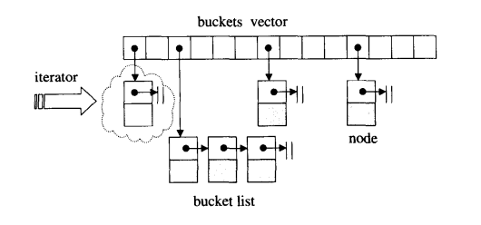

# This is to learn stl hash table structure.
1. 首先, hashtable是一种可以使用**常数**平均时间复杂度进行**查找**(包括**查找、插入、删除**)操作的数据结构, 是stl中unordered_map的底层实现<br>
   
2. 与之对应的则是红黑树(rb-tree), 是stl中map的底层实现, 与hashtable相区别的是, 红黑树中的顺序是有序的, 红黑树会动态地调整内部元素的顺序; 而hashtable中则是无序的, 对应着*Python*中的**字典**结构<br>
   
3. 谈hashmap首先需要先了解几个概念<br>
**hash function**: 假设有很多的元素需要存储到array中, 对于一个过于大的array型存储, 将大数映射为小数, 负责将某一个元素映射为一个大小可以接受的索引
hash function可能出现的**问题**: 可能有不同的元素被映射到相同的位置, 这是无法避免的, 因为元素个数大于array容量, 这个问题叫做 _collision_ <br>
如何解决 _collision_ : **linear probing**(线性探测), **quadratic probing**(二次探测), **separate chaining**(开链)...每一种方法的导出效率都不同, 且和array填满的程度有关系, 其中stl中使用开链法<br>

4. hashtable中的**buckets**和**nodes**

hashtable中的node, 与list中的node类似, 都需要指向下一个节点的地址<br>
在hashtable中, 节点定义如下：
    ```
    struct _Hash_node_base
    {
        _Hash_node_base* _M_nxt;

        _Hash_node_base() noexcept : _M_nxt() { }

        _Hash_node_base(_Hash_node_base* __next) noexcept : _M_nxt(__next) { }
    };
    ...
    template<typename _Value>
    struct _Hash_node<_Value, true> : _Hash_node_value_base<_Value>
    {
        std::size_t  _M_hash_code;

        _Hash_node*
        _M_next() const noexcept
        { return static_cast<_Hash_node*>(this->_M_nxt); }
    };
    ```
    可以从图上看到, 每一个*bucket*都维护着一些*nodes*, 或者说每个bucket都是一个linked list. 然而, bucket维护的这个linked list, 并不采用stl中的list或者slist数据结构, 而是自行维护.

5. hashtable迭代器的定义如下(*include/bits/hashtable_policy.h*):
   ```
    template<typename _Value, bool __constant_iterators, bool __cache>
    struct _Node_iterator : public _Node_iterator_base<_Value, __cache>
    {
    private:
      using __base_type = _Node_iterator_base<_Value, __cache>;
      using __node_type = typename __base_type::__node_type;

    public:
      typedef _Value					value_type;
      typedef std::ptrdiff_t				difference_type;
      typedef std::forward_iterator_tag			iterator_category;

      using pointer = typename std::conditional<__constant_iterators,
						const _Value*, _Value*>::type;

      using reference = typename std::conditional<__constant_iterators,
						  const _Value&, _Value&>::type;

      _Node_iterator() noexcept
      : __base_type(0) { }

      explicit
      _Node_iterator(__node_type* __p) noexcept
      : __base_type(__p) { }

      reference
      operator*() const noexcept
      { return this->_M_cur->_M_v(); }

      pointer
      operator->() const noexcept
      { return this->_M_cur->_M_valptr(); }

      _Node_iterator&
      operator++() noexcept
      {
	    this->_M_incr();
	    return *this;
      }

      _Node_iterator
      operator++(int) noexcept
      {
	    _Node_iterator __tmp(*this);
	    this->_M_incr();
	    return __tmp;
      }
    };
   ```
   可以看到, hashtable没有后退操作(--), 也没有reverse iterator<br>
   hashtable的iterator必须维持整个"bucket vector"的关系, 

6. hashing policies: 对于hash函数, stl库中提供了很多的hash policy, 有取余, prime_rehashing等, 如下所示:
   ```
    // Many of class template _Hashtable's template parameters are policy
    // classes.  These are defaults for the policies.

    /// Default range hashing function: use division to fold a large number
    /// into the range [0, N).
    struct _Mod_range_hashing
    {
        typedef std::size_t first_argument_type;
        typedef std::size_t second_argument_type;
        typedef std::size_t result_type;

        result_type
        operator()(first_argument_type __num,
	        second_argument_type __den) const noexcept
        { return __num % __den; }
    };
    ......

    /// Default value for rehash policy.  Bucket size is (usually) the
    /// smallest prime that keeps the load factor small enough.
    struct _Prime_rehash_policy
    {
        using __has_load_factor = std::true_type;

        _Prime_rehash_policy(float __z = 1.0) noexcept
        : _M_max_load_factor(__z), _M_next_resize(0) { }

        float
        max_load_factor() const noexcept
        { return _M_max_load_factor; }

        // Return a bucket size no smaller than n.
        std::size_t
        _M_next_bkt(std::size_t __n) const;

        // Return a bucket count appropriate for n elements
        std::size_t
        _M_bkt_for_elements(std::size_t __n) const
        { return __builtin_ceil(__n / (long double)_M_max_load_factor); }

        // __n_bkt is current bucket count, __n_elt is current element count,
        // and __n_ins is number of elements to be inserted.  Do we need to
        // increase bucket count?  If so, return make_pair(true, n), where n
        // is the new bucket count.  If not, return make_pair(false, 0).
        std::pair<bool, std::size_t>
        _M_need_rehash(std::size_t __n_bkt, std::size_t __n_elt,
		   std::size_t __n_ins) const;

        typedef std::size_t _State;

        _State
        _M_state() const
        { return _M_next_resize; }

        void
        _M_reset() noexcept
        { _M_next_resize = 0; }

        void
        _M_reset(_State __state)
        { _M_next_resize = __state; }

        static const std::size_t _S_growth_factor = 2;

        float		_M_max_load_factor;
        mutable std::size_t	_M_next_resize;
    };
    ......

    /// Range hashing function assuming that second arg is a power of 2.
    struct _Mask_range_hashing
    {
        typedef std::size_t first_argument_type;
        typedef std::size_t second_argument_type;
        typedef std::size_t result_type;

        result_type
        operator()(first_argument_type __num,
	        second_argument_type __den) const noexcept
        { return __num & (__den - 1); }
    };

   ```

7. hashtable的定义, 源码如下:
   ```
     /**
   *  Primary class template _Hashtable_base.
   *
   *  Helper class adding management of _Equal functor to
   *  _Hash_code_base type.
   *
   *  Base class templates are:
   *    - __detail::_Hash_code_base
   *    - __detail::_Hashtable_ebo_helper
   */
    template<typename _Key, typename _Value,
	   typename _ExtractKey, typename _Equal,
	   typename _H1, typename _H2, typename _Hash, typename _Traits>
    struct _Hashtable_base
    : public _Hash_code_base<_Key, _Value, _ExtractKey, _H1, _H2, _Hash,
			   _Traits::__hash_cached::value>,
    private _Hashtable_ebo_helper<0, _Equal>
    {
    public:
        typedef _Key					key_type;
        typedef _Value					value_type;
        typedef _Equal					key_equal;
        typedef std::size_t					size_type;
        typedef std::ptrdiff_t				difference_type;

        using __traits_type = _Traits;

        using __hash_cached = typename               __traits_type::__hash_cached;

        using __constant_iterators = typename __traits_type::__constant_iterators;

        using __unique_keys = typename __traits_type::__unique_keys;

        using __hash_code_base = _Hash_code_base<_Key, _Value, _ExtractKey,
					     _H1, _H2, _Hash,
					     __hash_cached::value>;

        using __hash_code = typename __hash_code_base::__hash_code;
        using __node_type = typename __hash_code_base::__node_type;

        using iterator = __detail::_Node_iterator<value_type,
					      __constant_iterators::value,
					      __hash_cached::value>;

        using const_iterator = __detail::_Node_const_iterator<value_type,
						   __constant_iterators::value,
						   __hash_cached::value>;

        using local_iterator = __detail::_Local_iterator<key_type, value_type,
						  _ExtractKey, _H1, _H2, _Hash,
						  __constant_iterators::value,
						     __hash_cached::value>;

        using const_local_iterator = __detail::_Local_const_iterator<key_type,
								 value_type,
					_ExtractKey, _H1, _H2, _Hash,
					__constant_iterators::value,
					__hash_cached::value>;

        using __ireturn_type = typename std::conditional<__unique_keys::value,
						     std::pair<iterator, bool>,
						     iterator>::type;
    private:
        using _EqualEBO = _Hashtable_ebo_helper<0, _Equal>;
        using _EqualHelper =  _Equal_helper<_Key, _Value, _ExtractKey, _Equal,
					__hash_code, __hash_cached::value>;

    protected:
        _Hashtable_base() = default;
        _Hashtable_base(const _ExtractKey& __ex, const _H1& __h1, const _H2& __h2,
		    const _Hash& __hash, const _Equal& __eq)
        : __hash_code_base(__ex, __h1, __h2, __hash), _EqualEBO(__eq) { }

    bool
    _M_equals(const _Key& __k, __hash_code __c, __node_type* __n) const
    {
        static_assert(__is_invocable<const _Equal&, const _Key&, const _Key&>{},
	    "key equality predicate must be invocable with two arguments of "
	    "key type");
        return _EqualHelper::_S_equals(_M_eq(), this->_M_extract(),
				     __k, __c, __n);
    }

    void
    _M_swap(_Hashtable_base& __x)
    {
        __hash_code_base::_M_swap(__x);
        std::swap(_M_eq(), __x._M_eq());
    }

    const _Equal&
    _M_eq() const { return _EqualEBO::_S_cget(*this); }

    _Equal&
    _M_eq() { return _EqualEBO::_S_get(*this); }

    };


   ```
8. Q: 为什么说hashtable中的bucket是以vector形式存储在内存空间中的? <br>
   A: 可以从hashtable中bucket的内存分配中看出 <br>
   ```
    template<typename _NodeAlloc>
    typename _Hashtable_alloc<_NodeAlloc>::__bucket_type*
    _Hashtable_alloc<_NodeAlloc>::_M_allocate_buckets(std::size_t __n)
    {
      __bucket_alloc_type __alloc(_M_node_allocator());

      auto __ptr = __bucket_alloc_traits::allocate(__alloc, __n);
      __bucket_type* __p = std::__to_address(__ptr);
      __builtin_memset(__p, 0, __n * sizeof(__bucket_type)); 
      // 连续分配了__n块内存空间, 存储结构为vector
      return __p;
    }
   ```
9. hashmap的定义方式是基于hashtable_policy.h文件中的5个template类继承而来的, 分别为`__detail::_Hashtable_base`, `__detail::_Map_base`, `__detail::_Insert`, `__detail::_Rehash_base`, `__detail::_Equality`. 如果用stl中的container来类比的话, hashtable更像是一个由*list*组成的*vector*, hashtable的源码定义如下:
    ```
    template<typename _Key, typename _Value, typename _Alloc,
	   typename _ExtractKey, typename _Equal,
	   typename _H1, typename _H2, typename _Hash,
	   typename _RehashPolicy, typename _Traits>
    class _Hashtable
    : public __detail::_Hashtable_base<_Key, _Value, _ExtractKey, _Equal,
				       _H1, _H2, _Hash, _Traits>,
      public __detail::_Map_base<_Key, _Value, _Alloc, _ExtractKey, _Equal,
				 _H1, _H2, _Hash, _RehashPolicy, _Traits>,
      public __detail::_Insert<_Key, _Value, _Alloc, _ExtractKey, _Equal,
			       _H1, _H2, _Hash, _RehashPolicy, _Traits>,
      public __detail::_Rehash_base<_Key, _Value, _Alloc, _ExtractKey, _Equal,
				    _H1, _H2, _Hash, _RehashPolicy, _Traits>,
      public __detail::_Equality<_Key, _Value, _Alloc, _ExtractKey, _Equal,
				 _H1, _H2, _Hash, _RehashPolicy, _Traits>,
      private __detail::_Hashtable_alloc<
	typename __alloctr_rebind<_Alloc,
	  __detail::_Hash_node<_Value,
			       _Traits::__hash_cached::value> >::__type>
    {
        ...
    }
    ```
10. hashtable中几个重要的函数:
    `find`, 
    ```
    template<typename _Key, typename _Value,
	   typename _Alloc, typename _ExtractKey, typename _Equal,
	   typename _H1, typename _H2, typename _Hash, typename _RehashPolicy,
	   typename _Traits>
    typename _Hashtable<_Key, _Value, _Alloc, _ExtractKey, _Equal,
			_H1, _H2, _Hash, _RehashPolicy,
			_Traits>::const_iterator
    _Hashtable<_Key, _Value, _Alloc, _ExtractKey, _Equal,
	       _H1, _H2, _Hash, _RehashPolicy, _Traits>::
    find(const key_type& __k) const
    {
      __hash_code __code = this->_M_hash_code(__k);
      std::size_t __n = _M_bucket_index(__k, __code);
      __node_type* __p = _M_find_node(__n, __k, __code);
      return __p ? const_iterator(__p) : end();
    }
    ```
    `insert(unconditionally)`
    ```
    template<typename _Key, typename _Value,
	   typename _Alloc, typename _ExtractKey, typename _Equal,
	   typename _H1, typename _H2, typename _Hash, typename _RehashPolicy,
	   typename _Traits>
    template<typename _Arg, typename _NodeGenerator>
      typename _Hashtable<_Key, _Value, _Alloc, _ExtractKey, _Equal,
			  _H1, _H2, _Hash, _RehashPolicy,
			  _Traits>::iterator
      _Hashtable<_Key, _Value, _Alloc, _ExtractKey, _Equal,
		 _H1, _H2, _Hash, _RehashPolicy, _Traits>::
      _M_insert(const_iterator __hint, _Arg&& __v,
		const _NodeGenerator& __node_gen,
		std::false_type)
      {
	// First compute the hash code so that we don't do anything if it
	// throws.
	__hash_code __code = this->_M_hash_code(this->_M_extract()(__v));

	// Second allocate new node so that we don't rehash if it throws.
	__node_type* __node = __node_gen(std::forward<_Arg>(__v));

	return _M_insert_multi_node(__hint._M_cur, __code, __node);
      }
    ```
    `erase`
    ```
    template<typename _Key, typename _Value,
	   typename _Alloc, typename _ExtractKey, typename _Equal,
	   typename _H1, typename _H2, typename _Hash, typename _RehashPolicy,
	   typename _Traits>
    typename _Hashtable<_Key, _Value, _Alloc, _ExtractKey, _Equal,
			_H1, _H2, _Hash, _RehashPolicy,
			_Traits>::iterator
    _Hashtable<_Key, _Value, _Alloc, _ExtractKey, _Equal,
	       _H1, _H2, _Hash, _RehashPolicy, _Traits>::
    erase(const_iterator __it)
    {
      __node_type* __n = __it._M_cur;
      std::size_t __bkt = _M_bucket_index(__n);

      // Look for previous node to unlink it from the erased one, this
      // is why we need buckets to contain the before begin to make
      // this search fast.
      __node_base* __prev_n = _M_get_previous_node(__bkt, __n);
      return _M_erase(__bkt, __prev_n, __n);
    }
    ```
    ...
    hashmap代码是我迄今为止阅读过的最为复杂的c++代码, 其中除了数据结构的精妙, 还有对于一些设计模式的灵活使用, 即stl的iterator, traits萃取器的思想, 在hashmap中都可以体现. 短短三四天的学习真的很难将此源码全部吃透看懂, 我目前也仅是看懂了一部分, 阅读这种设计的代码, 虽然不能完全看懂, 但是仔细研究, 真的对我阅读代码的能力做了很大的提升.


