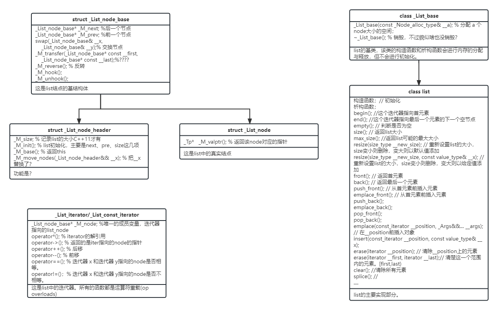

## STL: list

### list概述

list的底层实现是双头链表。

他的查询的时间复杂度是线性的，插入和删除元素的时间复杂度是常数级的，无论发生变化的元素位置在哪。不像`std::vector` 和 `std::deque`，list没有提供 random-access iterator，所以 subscripting access（即[]）是不允许的。

vector的时间复杂度：

- 插入：o(1)
- 删除：o(1)
- 改：o(n)
- 查：o(n)

list可以表示为

```
A <---> B <---> C <---> D
```

list会有一个私有成员变量`list::iterator`，**指向 D，而不是 A**。而且**真实情况是list是一个环状双头链表**，D的next指向了A。这一点可以从源码的`list::begin()`函数中看出端倪。

### list源码阅读

阅读的代码时gcc-9的SGI STL，不同版本的STL实现的细节会有差异，这里主要介绍使用接口。

#### 基础list_node结构

##### **struct _List_node_base**

这是list结点的基结构体

```cpp
_List_node_base* _M_next; //后一个节点
_List_node_base* _M_prev; //前一个节点
swap(_List_node_base& __x, 
    _List_node_base& __y);// 交换节点
_M_transfer(_List_node_base* const __first,
    _List_node_base* const __last);// ????
_M_reverse(); // 反转
_M_hook();
_M_unhook();
```


##### struct **_List_node_header**

```cpp
_M_size; // 记录list的大小C++11才有
_M_init(); // list初始化，主要是next、pre、size这几项
_M_base(); // 返回this
_M_move_nodes(_List_node_header&& __x); // 把__x替换了？
```


##### struct **_List_node**

这是list中的真实结点结构，继承自 _list_node_base

```cpp
_Tp*   _M_valptr(); // 返回该node对应val 的指针，这里并没有直接保存val
```


#### List的迭代器

##### **_List_iterator/List_const_iterator**

这是list中的迭代器。所有的函数都是运算符重载(op overloads)

```cpp
_List_node_base* _M_node; //唯一的成员变量，迭代器指向的list_node
operator*(); // iterator的解引用
operator->(); // 返回的是iter指向的node的指针
operator++(); // 后移
operator--(); // 前移
operator==(); // 迭代器 x 和迭代器 y指向的node是否相等。
operator!=()；// 迭代器 x 和迭代器 y指向的node是否不相等。
```


#### List的类

##### **class _List_base**

list的基类，该类的构造函数和析构函数会进行内存的分配与释放，但不会进行初始化。

```cpp
_List_base(const _Node_alloc_type& __a); % 分配 a 个node大小的空间；
~_List_base(); % 销毁，不过貌似啥也没销毁？
```


##### **class list**

```cpp
构造函数；// 初始化
析构函数；
begin(); //这个迭代器指向首元素
end(); //这个迭代器指向最后一个元素的下一个空节点
empty(); // 判断是否为空
size(); // 返回list大小
max_size(); //返回list可能的最大大小
resize(size_type __new_size); // 重新设置list的大小，size变小则删除，变大则以默认值添加
resize(size_type __new_size, const value_type& __x); // 重新设置list的大小，size变小则删除，变大则以给定值添加
front(); // 返回首元素
back(); // 返回最后一个元素
push_front(); // 从首元素前插入元素
emplace_front(); // 从首元素前插入元素
push_back();
emplace_back();
pop_front();
pop_back();
emplace(const_iterator __position, _Args&&... __args); // 在__position前插入对象
insert(const_iterator __position, const value_type& __x);
erase(iterator __position); // 清除__position上的元素
erase(iterator __first, iterator __last);// 清楚这一个范围内的元素。[first,last)
clear(); //清除所有元素
splice(); //
sort();// list不能使用STL提供的sort(),只能使用自己的sort
```


#### 继承关系




### 存疑部分？

- allocater？与new malloc的关系？

  allocater是STL中最不起眼的，但是这却是STL实现的基础。

  malloc/free只进行内存的分配和释放；内存分配失败返回null；返回的是`void *`的指针，需要用户根据情况进一步进行类型转换。

  new/delete除了分配和释放内存，也会调用构造和析构函数；内存分配失败会抛出异常；是类型安全的，返回具体类型的指针。

  new 内含两个阶段操作：1、调用operator new 配置内存。2、调用构造函数，构造对象内容 delete也内含两个阶段操作：1、调用析构函数。2、调用operator delete 释放内存。

  STL 将这两个阶段操作区分开来。**内存配置操作由 成员函数 alloccate() 负责，内存释放由 deallcate() 负责；对象构造由 construct() 负责，对象析构则由 destroy() 负责**。同时，为了解决内存碎片的问题，采用了双击配置器；为了缓解频繁申请释放内存的开销，采用复杂的内存池管理方式。


