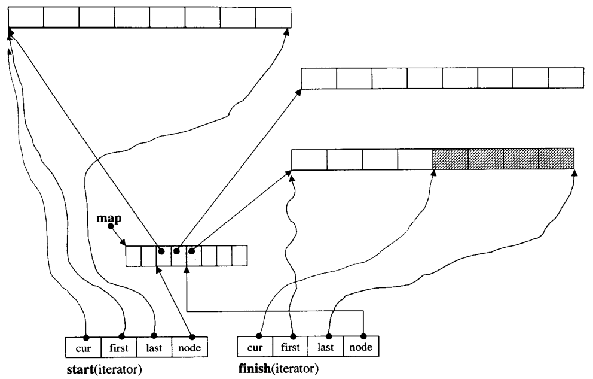

# stl_deque源码阅读

## deque概述

`deque`（双端队列）。`deque` 的全称为 "double-ended queue"，它是一种动态数组的扩展，允许在两端进行高效的插入和删除操作。

时间复杂度：

- 插入：两端：`O(1)`
- 删除：两端：`O(1)`
- 修改：`O(1)`
- 查询：`O(1)`

deque的特点是：

1. 随机访问：`deque` 支持随机访问，可以通过索引访问元素，时间复杂度为 O(1)。这意味着你可以通过下标或迭代器直接访问 `deque` 中的元素，也可以使用迭代器进行遍历。
2. 高效的插入和删除：与向量（`vector`）不同，`deque` 在两端进行插入和删除操作的时间复杂度为 O(1)。这意味着你可以在前端和后端快速地插入和删除元素，而不会涉及到移动其他元素的操作。
3. 不连续的存储空间：`deque` 的内部实现采用多个固定大小的缓冲区（通常为连续内存块），每个缓冲区存储一部分元素，并通过指针链接在一起。这使得 `deque` 的内存布局不连续，但元素的访问和操作仍然保持高效。
4. 动态调整大小：`deque` 具有动态调整大小的能力，可以根据需要进行动态扩展或收缩，以适应元素的数量变化。因此，你无需提前指定容器的大小。

## deque的基本结构

deque可以实现在两端进行插入和删除，即既可以`push_back()`也可以`push_front()`。

然而，与vector更不同的一点是，deque在进行扩容的时候，并不会发生拷贝或移动，目前已有的元素地址并不会发生改变。（vector进行扩容是需要先开辟一段为之前大小2倍的新的空间，然后将原来的元素**移动**到新开辟的空间，并释放原空间。）

```cpp
std::vector<int> vec;
vec.push_back(1);
std::cout << &vec[0] << std::endl;
vec.push_back(2);
std::cout << &vec[0] << std::endl;
vec.push_back(3);
std::cout << &vec[0] << std::endl;
vec.push_back(4);
std::cout << &vec[0] << std::endl;
vec.push_back(5);
std::cout << &vec[0] << std::endl;
=====================================
0xfc6cf0
0xfc6d10
0xfc6cf0
0xfc6cf0
0xfc6d10 //每一次扩容 vec[0] 的地址都发生改变
```

```cpp
std::deque<int> vec;
vec.push_back(1);
std::cout << &vec[0] << std::endl;
vec.push_back(2);
std::cout << &vec[0] << std::endl;
vec.push_back(3);
std::cout << &vec[0] << std::endl;
vec.push_back(4);
std::cout << &vec[0] << std::endl;
vec.push_back(5);
std::cout << &vec[0] << std::endl;
======================================
0x726d40
0x726d40
0x726d40
0x726d40
0x726d40 //每一次扩容 vec[0] 的地址不发生改变
```

之所以会有这种现象，是跟deque的结构有关，在deque中，存储是利用如下结构实现的。deque中底层有一系列相同大小的buffer，并且由一个map记录着每一个buffer的起始地址，



对应源码中

```cpp
//This struct encapsulates the implementation of the std::deque
//standard container and at the same time makes use of the EBO
//for empty allocators.
struct _Deque_impl: public _Tp_alloc_type
{
    _Map_pointer _M_map; // 中控器
    size_t _M_map_size; // 共有几块buffer
    iterator _M_start; // 通过这个可以找到第一个缓冲区
    iterator _M_finish; // 通过这个可以找到最后一个缓冲区
    ...
}
```

其中迭代器中有如下重要成员

```cpp
_Elt_pointer _M_cur; // 指向当前iterator对应的元素
_Elt_pointer _M_first; // 指向当前iterator对应的元素所在buffer的头部
_Elt_pointer _M_last; // 指向当前iterator对应的元素所在buffer的尾部
_Map_pointer _M_node;// 指向当前iterator对应的元素所在buffer所对应的中控器
```


## deque是如何在两端插入和删除的？

```cpp
void
push_front(const value_type& __x)
{
	// 当前buffer未满
    if (this->_M_impl._M_start._M_cur != this->_M_impl._M_start._M_first)
    {
        _Alloc_traits::construct(this->_M_impl, this->_M_impl._M_start._M_cur - 1, __x); //直接构造
        --this->_M_impl._M_start._M_cur; // 前移
    }
    else
    	_M_push_front_aux(__x); // 当前buffer已满，开辟新的内存
}

void
push_back(const value_type& __x)
{
    // 未满
    if (this->_M_impl._M_finish._M_cur
        != this->_M_impl._M_finish._M_last - 1)
    {
        _Alloc_traits::construct(this->_M_impl,
                                 this->_M_impl._M_finish._M_cur, __x);
        ++this->_M_impl._M_finish._M_cur; // 后移
    }
    else
        _M_push_back_aux(__x);
}
```

```cpp
void
    pop_front() _GLIBCXX_NOEXCEPT
{
    __glibcxx_requires_nonempty();
    //未空
    if (this->_M_impl._M_start._M_cur
        != this->_M_impl._M_start._M_last - 1)
    {
        _Alloc_traits::destroy(this->_M_impl,
                               this->_M_impl._M_start._M_cur);
        ++this->_M_impl._M_start._M_cur; // 后移
    }
    else
        _M_pop_front_aux();
}

void
pop_back() _GLIBCXX_NOEXCEPT
{
    __glibcxx_requires_nonempty();
    // 当前buffer未空
    if (this->_M_impl._M_finish._M_cur
        != this->_M_impl._M_finish._M_first)
    {
        --this->_M_impl._M_finish._M_cur; // 前移
        _Alloc_traits::destroy(this->_M_impl,
                               this->_M_impl._M_finish._M_cur); //释放
    }
    else
        _M_pop_back_aux();
}
```

