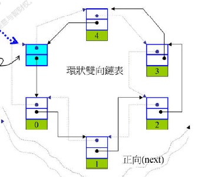
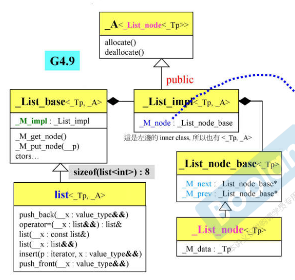
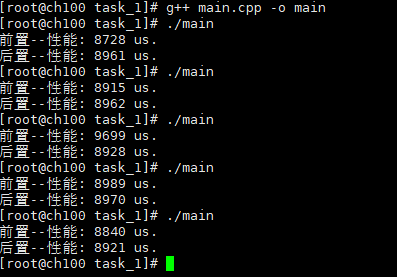

# list学习

## 1. list简介

`std::list` 的特点如下：

1. list是一个环状双向链表，通常只需一个指针，便可表示整个环状双向链表。迭代器为Bidirectional Iterator
2. 通常在环状双向链表尾端加一空白节点，用以符合前闭后开区间。




## 2. 源码UML图介绍



这里可以看出list的整体结构，重点关注链表节点（`_List_node<_Tp>`）和链表( ` list<_Tp,_A> ` )的实现和关系。

## 3.源码介绍

### 3.1 链表节点学习

```c++
struct _List_node_base
{
  _List_node_base* _M_next;
  _List_node_base* _M_prev;

  static void
  swap(_List_node_base& __x, _List_node_base& __y) _GLIBCXX_USE_NOEXCEPT;

  void
  _M_transfer(_List_node_base* const __first,
	  _List_node_base* const __last) _GLIBCXX_USE_NOEXCEPT;

  void
  _M_reverse() _GLIBCXX_USE_NOEXCEPT;

  void
  _M_hook(_List_node_base* const __position) _GLIBCXX_USE_NOEXCEPT;

  void
  _M_unhook() _GLIBCXX_USE_NOEXCEPT;
};
```

首先构建一个不带数据的链表节点,`_List_node_base`放前后指针

```c++
  template<typename _Tp>
    struct _List_node : public __detail::_List_node_base
    {
#if __cplusplus >= 201103L
      __gnu_cxx::__aligned_membuf<_Tp> _M_storage;
      _Tp*       _M_valptr()       { return _M_storage._M_ptr(); }
      _Tp const* _M_valptr() const { return _M_storage._M_ptr(); }
#else
      _Tp _M_data;
      _Tp*       _M_valptr()       { return std::__addressof(_M_data); }
      _Tp const* _M_valptr() const { return std::__addressof(_M_data); }
#endif
    };
```

这里可以继承 _List_node_base 后，` _List_node`再加入数据元素即构成了双向环状链表节点

### 3.2 链表数据结构学习

list继承于`_List_base`,而`_List_base`中有个结构体`_List_impl<_Tp,_A>`,而`_List_impl`中有一个`List_node_base`

### 3.3 迭代器学习

```c++
 template<typename _Tp>
    struct _List_iterator
    {
      typedef _List_iterator<_Tp>                _Self;
      typedef _List_node<_Tp>                    _Node;
      typedef ptrdiff_t                          difference_type;
      typedef std::bidirectional_iterator_tag    iterator_category;
      typedef _Tp                                value_type;
      typedef _Tp*                               pointer;
      typedef _Tp&                               reference;
      
      // The only member points to the %list element.
      __detail::_List_node_base* _M_node; 
    }
```

迭代器内部有个普通指针，指向list的节点。并且迭代器实现了++ ->等操作符重载

```c++
reference operator*() const _GLIBCXX_NOEXCEPT {
    return static_cast<_Node*>(_M_node)->_M_data;
  }

  pointer operator->() const _GLIBCXX_NOEXCEPT {
    return std::__addressof(static_cast<_Node*>(_M_node)->_M_data);
  }

  _Self& operator++() _GLIBCXX_NOEXCEPT {
    _M_node = _M_node->_M_next;
    return *this;
  }

  _Self operator++(int) _GLIBCXX_NOEXCEPT {
    _Self __tmp = *this;
    _M_node = _M_node->_M_next;
    return __tmp;
  }

  _Self& operator--() _GLIBCXX_NOEXCEPT {
    _M_node = _M_node->_M_prev;
    return *this;
  }

  _Self operator--(int) _GLIBCXX_NOEXCEPT {
    _Self __tmp = *this;
    _M_node = _M_node->_M_prev;
    return __tmp;
  }

  bool operator==(const _Self& __x) const _GLIBCXX_NOEXCEPT {
    return _M_node == __x._M_node;
  }

  bool operator!=(const _Self& __x) const _GLIBCXX_NOEXCEPT {
    return _M_node != __x._M_node;
  }
```

## 4.测试

测试emplace_back()和push_back()的性能

centos7的代码测试结果：



