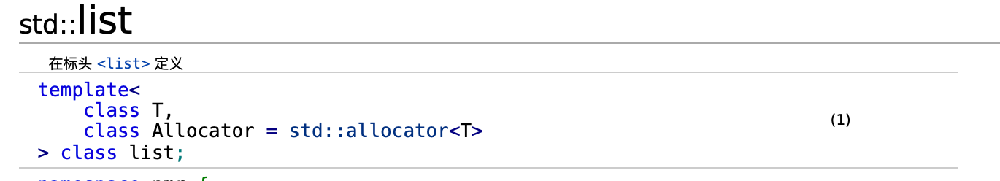

# Sw511 task 1 : learn list

## 什么是list
一个双向链表，可以高效地进行插入、删除和遍历操作，没有随机访问能力

## 在[cpp文档](https://zh.cppreference.com/w/cpp/container/list)中查看list的说明和成员函数、迭代器功能
...这里太多就不截图了...后面有收获单独说

## 一些我知道的操作：
在 list_learn.cpp中实现

## 阅读源码
链表节点的定义：
```
template<typename _Tp>
    struct _List_node : public __detail::_List_node_base
```

实际节点继承自`_List_node_base`在这个类中

11：增加了一个 `__gnu_cxx::__aligned_membuf` 类模板来对元素类型 `_Tp` 进行对齐存储，替换了11之前的直接使用类型变量存储数据。

紧接着是迭代器定义：

```
template<typename _Tp>
  struct _List_iterator
  {
    typedef _List_iterator<_Tp>		_Self;
    typedef _List_node<_Tp>			_Node;

    typedef ptrdiff_t				difference_type;
    // 双向迭代器
    typedef std::bidirectional_iterator_tag	iterator_category;
    typedef _Tp				value_type;
    typedef _Tp*				pointer;
    typedef _Tp&				reference;
    __detail::_List_node_base* node; //唯一成员
	  //构造函数
    //成员函数
}
```

在这里注意到了`operator++()`和`operator++(int)`前后缀递增运算符的区别，用一个整数参数（不被使用）来进行区分，前者返回递增后的迭代器值，后者返回之前迭代器值，用一个tmp临时变量实现。递减同理。

最后是list定义：

```
template<typename _Tp, typename _Alloc = std::allocator<_Tp> >
    class list : protected _List_base<_Tp, _Alloc>
```

继承自`_List_base<_Tp, _Alloc>` （typename复习：在模板实例化之前，编译器无法确定变量是否是一个类型名。因此，需要使用 `typename` 关键字告知编译器这是一个类型，以便在模板实例化时进行正确的解析。这是 C++ 模板中的语法要求。）

## 明天再看，第一次看很慢...