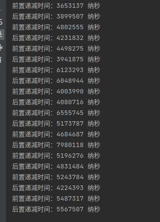
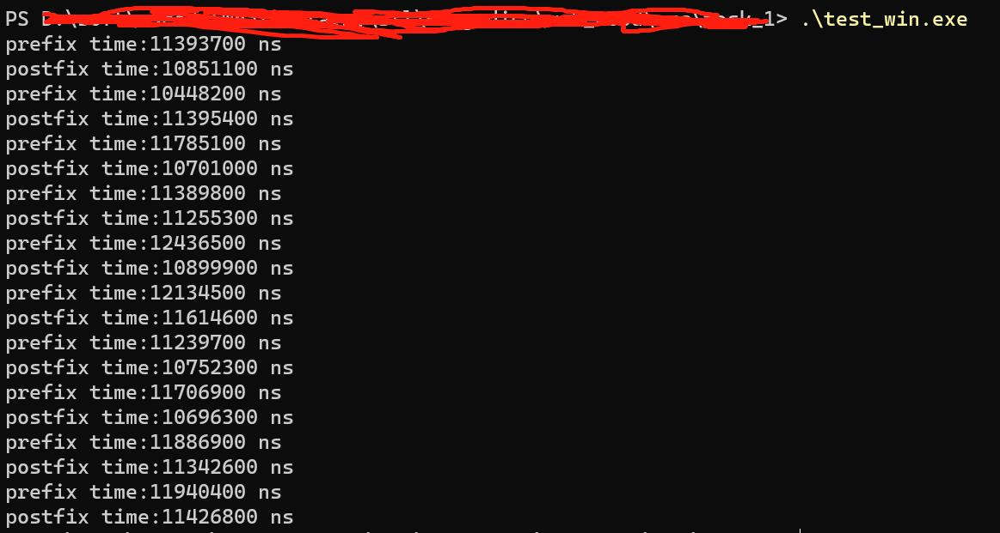

# stl list

## 关系图


## 宏学习

### _GLIBCXX_USE_NOEXCEPT

用于指示在编译C++代码时是否启用noexcept异常规范。noexcept是C++11引入的异常规范关键字，用于指示函数不会抛出任何异常。_GLIBCXX_USE_NOEXCEPT宏定义的存在可以用于控制在标准库实现中是否启用了noexcept异常规范。


## 类和结构体

> _List_iterator，所有函数都是对操作符进行重载

```C++
  /// Bidirectional iterators support a superset of forward iterator operations.
  struct bidirectional_iterator_tag : public forward_iterator_tag { };

  /**
   *  @brief A list::iterator.
   *
   *  All the functions are op overloads.
  */
  template<typename _Tp>
    struct _List_iterator
    {
      typedef _List_iterator<_Tp>                _Self;
      typedef _List_node<_Tp>                    _Node;

      typedef ptrdiff_t                          difference_type;
      typedef std::bidirectional_iterator_tag    iterator_category;
      typedef _Tp                                value_type;
      typedef _Tp*                               pointer;
      typedef _Tp&                               reference;
      
      // The only member points to the %list element.
      __detail::_List_node_base* _M_node;
    }
```

> ptrdiff_t

```C++
#define __PTRDIFF_TYPE__ long int
typedef __PTRDIFF_TYPE__ ptrdiff_t;
```

> 操作符前--和后--

```C++
//operator--() 是前置递减运算符，它在迭代器上进行递减操作并返回递减后的迭代器。
//它没有任何参数，并且在修改迭代器之后立即返回修改后的值。
_Self& operator++() _GLIBCXX_NOEXCEPT;

//operator--(int) 是后置递减运算符，它在迭代器上进行递减操作，但返回的是递减前的迭代器的副本。
//它有一个额外的 int 参数（这个参数没有实际意义），用于区分前置递减运算符。
_Self operator++(int) _GLIBCXX_NOEXCEPT;
```

> 没看懂的地方：(不清楚构造是怎样进行的)

```C++
  template<typename _Tp>
    struct _List_node : public __detail::_List_node_base
    {
      ///< User's data.
      _Tp _M_data;

#if __cplusplus >= 201103L
      template<typename... _Args>
        _List_node(_Args&&... __args)
	: __detail::_List_node_base(), _M_data(std::forward<_Args>(__args)...) 
        { }
#endif
    };
```

> std::forward

```C++
#include <iostream>
#include <utility>

struct A {
    A() { std::cout << "default constructor\n"; }
    A(const A&) { std::cout << "copy constructor\n"; }
    A(A&&) { std::cout << "move constructor\n"; }
};

void bar(const A& a) { std::cout << "bar(const A&)\n"; }
void bar(A&& a) { std::cout << "bar(A&&)\n"; }

template<typename T>
void foo(T&& t) {
    bar(t); // without perfect forwarding, always call bar(const A&)
    bar(std::forward<T>(t)); // with perfect forwarding, call bar(A&) or bar(A&&) depending on T
}

int main() {
    A a;
    foo(a); // T is deduced as A&, t is an lvalue reference
    foo(A()); // T is deduced as A, t is an rvalue reference
}

// output
// 使用std::forward时，可以根据参数是左值还是右值来调用不同的bar重载函数
default constructor
bar(const A&)
bar(const A&)
copy constructor
bar(const A&)
bar(A&&)
move constructor
bar(const A&)
bar(A&&)
```

> c++11 增加的改变

```C++
#if __cplusplus >= 201103L
      void
      merge(list&& __x);

      void
      merge(list& __x)
      { merge(std::move(__x)); }
#else
      void
      merge(list& __x);
#endif

#if __cplusplus >= 201103L
      erase(const_iterator __first, const_iterator __last) noexcept
#else
      erase(iterator __first, iterator __last)
#endif
      {
	while (__first != __last)
	  __first = erase(__first);
	return __last._M_const_cast();
      }
```

> erase函数 : 仅删除元素本身，如果元素是一个指针，那么指针指向的数据不受影响。没有清理的数据可能会造成之后的脏读。

```C++
// This function will erase the element at the given position and thus
// shorten the %list by one.
```


## 测试

观察到，前++和后++在源代码上有不同次数的拷贝构造，在各大网站上也对两种调用有多次提及，都说前++的性能更好。在本次学习中用list对前++和后++进行了性能测试。

### 1：windows环境

#### 代码:

```C++
#include <chrono>
#include <iostream>
#include <list>

int main() {
  for (int i = 0; i < 10; ++i) {
    std::list<int> myList;

    // Add 1000000 elements to the list
    for (int i = 0; i < 1000000; ++i) {
      myList.push_back(i);
    }

    // Test the performance of pre decrement
    auto startTime = std::chrono::high_resolution_clock::now();

    for (auto it = myList.begin(); it != myList.end(); ++it) {
      --(*it);
    }

    auto endTime = std::chrono::high_resolution_clock::now();
    auto duration =
        std::chrono::duration_cast<std::chrono::nanoseconds>(endTime - startTime);
    std::cout << "prefix time:" << duration.count() << " ns" << std::endl;

    // Test the performance of post decreasing
    startTime = std::chrono::high_resolution_clock::now();

    for (auto it = myList.begin(); it != myList.end(); it++) {
      (*it)--;
    }

    endTime = std::chrono::high_resolution_clock::now();
    duration = std::chrono::duration_cast<std::chrono::nanoseconds>(endTime - startTime);
    std::cout << "postfix time:" << duration.count() << " ns" << std::endl;
  }

  return 0;
}

```


测试结果如下：





### 2：ubuntu环境

g++-4.9的环境下使用benchmark有异常，因此测试环境为g++-7。

#### 代码：

```C++
#include <benchmark/benchmark.h>
#include <list>

// A helper function to fill a list with some values
void fill_list(std::list<int>& lst, int n) {
  for (int i = 0; i < n; ++i) {
    lst.push_back(i);
  }
}

// A benchmark function to test the prefix decrement
static void BM_PrefixDecrement(benchmark::State& state) {
  // Get the input size from the state
  int n = state.range(0);
  // Create a list with n elements
  std::list<int> lst;
  fill_list(lst, n);
  // Start the benchmark loop
  for (auto _ : state) {
    // Get an iterator to the end of the list
    auto it = lst.end();
    // Decrement the iterator n times using prefix decrement
    for (int i = 0; i < n; ++i) {
      --it;
    }
    // Prevent the compiler from optimizing away the loop
    benchmark::DoNotOptimize(it);
  }
}

// A benchmark function to test the postfix decrement
static void BM_PostfixDecrement(benchmark::State& state) {
  // Get the input size from the state
  int n = state.range(0);
  // Create a list with n elements
  std::list<int> lst;
  fill_list(lst, n);
  // Start the benchmark loop
  for (auto _ : state) {
    // Get an iterator to the end of the list
    auto it = lst.end();
    // Decrement the iterator n times using postfix decrement
    for (int i = 0; i < n; ++i) {
      it--;
    }
    // Prevent the compiler from optimizing away the loop
    benchmark::DoNotOptimize(it);
  }
}

BENCHMARK(BM_PrefixDecrement)->Range(8, 8 << 10);
BENCHMARK(BM_PostfixDecrement)->Range(8, 8 << 10);
BENCHMARK_MAIN();
```

#### 优化等级为“O0”执行结果：

```bash
2023-06-21T07:26:11-07:00
Running /home/ubuntu20/CLionProjects/StudyStl/cmake-build-debug/StudyStl
Run on (16 X 3792 MHz CPU s)
CPU Caches:
  L1 Data 32 KiB (x16)
  L1 Instruction 32 KiB (x16)
  L2 Unified 256 KiB (x16)
  L3 Unified 16384 KiB (x16)
Load Average: 0.17, 0.06, 0.03
-------------------------------------------------------------------
Benchmark                         Time             CPU   Iterations
-------------------------------------------------------------------
BM_PrefixDecrement/8           20.2 ns         20.2 ns     33211613
BM_PrefixDecrement/64           141 ns          141 ns      4997462
BM_PrefixDecrement/512         1079 ns         1079 ns       653650
BM_PrefixDecrement/4096       10102 ns        10100 ns        69184
BM_PrefixDecrement/8192       21150 ns        21149 ns        32690
BM_PostfixDecrement/8          26.4 ns         26.4 ns     26352302
BM_PostfixDecrement/64          188 ns          188 ns      3723736
BM_PostfixDecrement/512        1438 ns         1437 ns       485932
BM_PostfixDecrement/4096      13593 ns        13587 ns        52119
BM_PostfixDecrement/8192      28160 ns        28144 ns        23895

Process finished with exit code 0

```

#### 优化等级为“O1”执行结果：

```bash
2023-06-21T07:36:42-07:00
Running /home/ubuntu20/CLionProjects/StudyStl/cmake-build-debug/StudyStl
Run on (16 X 3792 MHz CPU s)
CPU Caches:
  L1 Data 32 KiB (x16)
  L1 Instruction 32 KiB (x16)
  L2 Unified 256 KiB (x16)
  L3 Unified 16384 KiB (x16)
Load Average: 0.36, 0.25, 0.12
-------------------------------------------------------------------
Benchmark                         Time             CPU   Iterations
-------------------------------------------------------------------
BM_PrefixDecrement/8           2.54 ns         2.54 ns    270554092
BM_PrefixDecrement/64          34.2 ns         34.2 ns     20821073
BM_PrefixDecrement/512          452 ns          452 ns      1576545
BM_PrefixDecrement/4096        6492 ns         6492 ns       113878
BM_PrefixDecrement/8192       14939 ns        14938 ns        43320
BM_PostfixDecrement/8          4.11 ns         4.10 ns    171836666
BM_PostfixDecrement/64         32.8 ns         32.7 ns     21500002
BM_PostfixDecrement/512         448 ns          448 ns      1574040
BM_PostfixDecrement/4096       6486 ns         6485 ns        95440
BM_PostfixDecrement/8192      14496 ns        14490 ns        40142
```

#### 优化等级为“O2”执行结果：

```bash
2023-06-21T07:28:04-07:00
Running /home/ubuntu20/CLionProjects/StudyStl/cmake-build-debug/StudyStl
Run on (16 X 3792 MHz CPU s)
CPU Caches:
  L1 Data 32 KiB (x16)
  L1 Instruction 32 KiB (x16)
  L2 Unified 256 KiB (x16)
  L3 Unified 16384 KiB (x16)
Load Average: 0.07, 0.07, 0.04
-------------------------------------------------------------------
Benchmark                         Time             CPU   Iterations
-------------------------------------------------------------------
BM_PrefixDecrement/8           2.44 ns         2.44 ns    284707128
BM_PrefixDecrement/64          32.7 ns         32.7 ns     21536442
BM_PrefixDecrement/512          451 ns          450 ns      1584744
BM_PrefixDecrement/4096        6085 ns         6075 ns       113872
BM_PrefixDecrement/8192       13770 ns        13734 ns        52906
BM_PostfixDecrement/8          2.46 ns         2.46 ns    285768805
BM_PostfixDecrement/64         32.6 ns         32.6 ns     21529298
BM_PostfixDecrement/512         443 ns          443 ns      1586453
BM_PostfixDecrement/4096       6669 ns         6662 ns       108448
BM_PostfixDecrement/8192      13173 ns        13168 ns        51369
```

### 结论：

因为编译器的优化，前++和后++在实际编码的过程中性能差异是不一样的。当优化等级为“O2”时，这种“前++”已经没有优势了。在实际编码时，尽量还是保持使用前++的风格，可以避免因为优化程度不同导致的性能损失。
