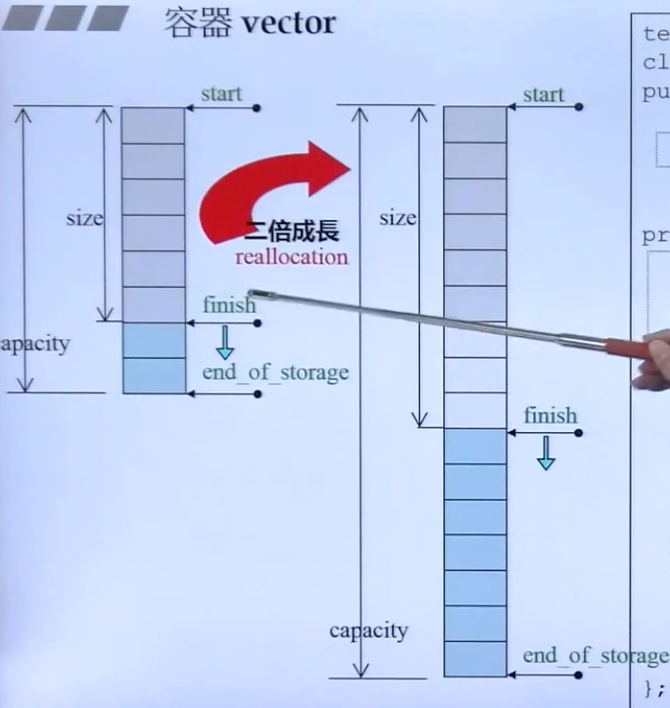
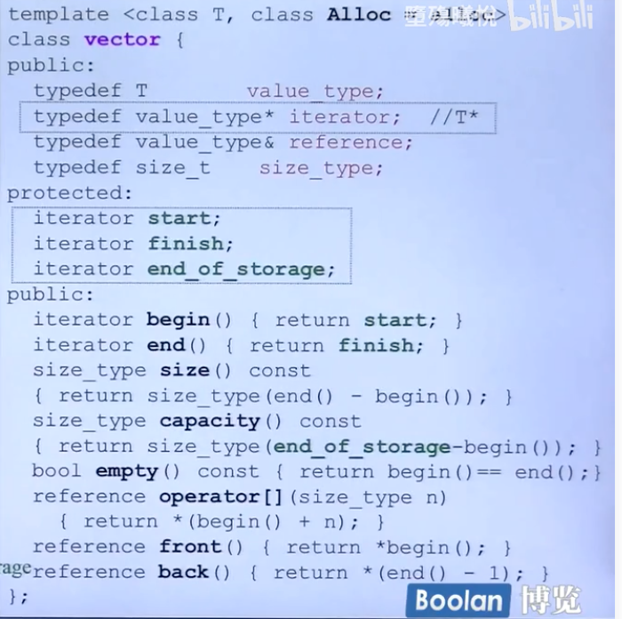
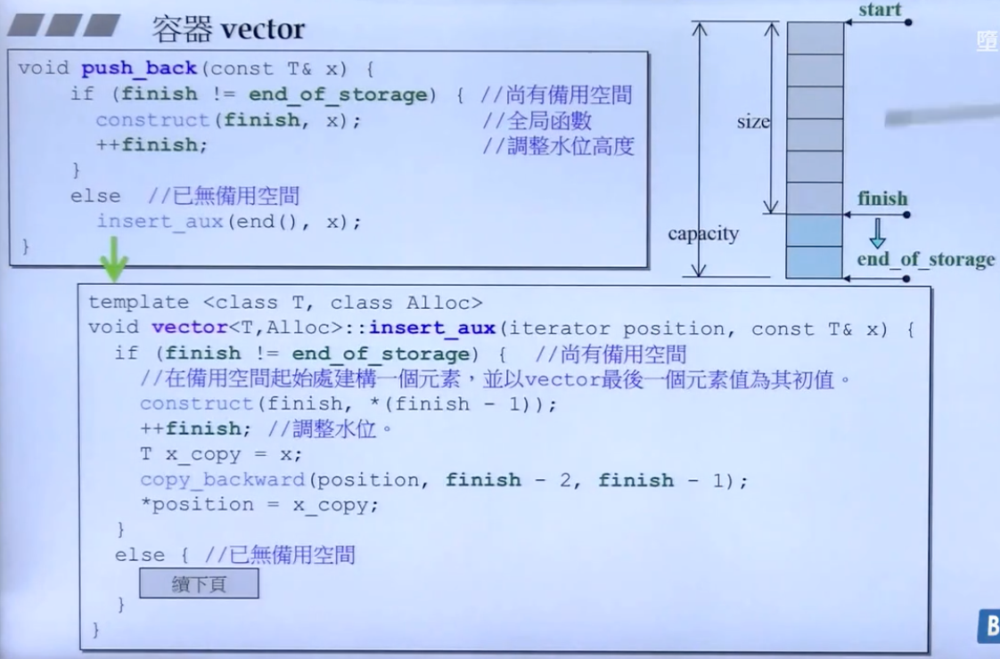
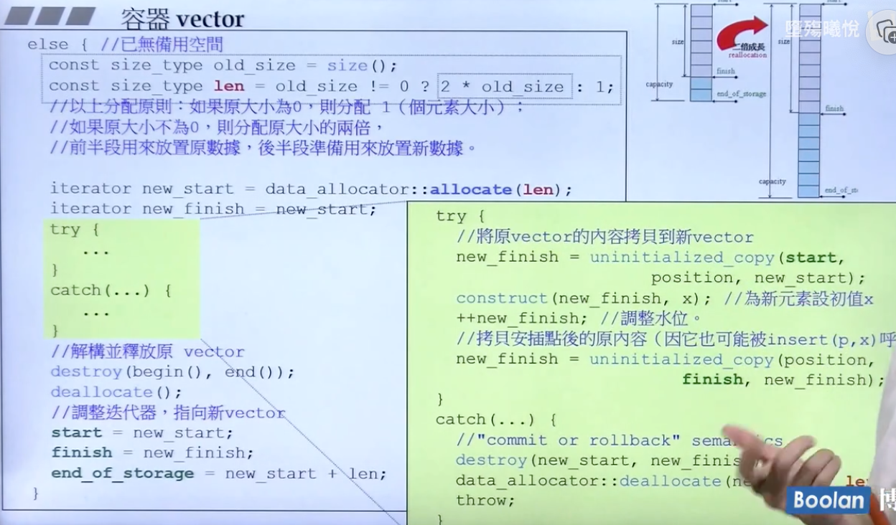
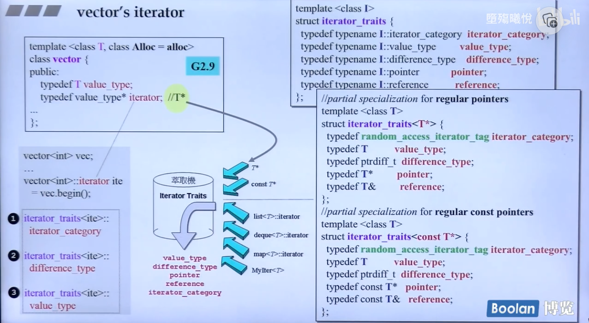

# stl_note_vector

## Day2 面试必备-vector

vector 就好像一个数组，当数组用完之后它会自动扩充。可以认为，vector 是一个可以存放任意类型的动态数组。

扩充必须寻找一个新的区域复制过去，而不是原地扩充。

start 代表vector 的开始，finish代表vector的结束，end_of_storage 代表vector存储空间的结束。

vector 的扩充，就是两倍成长的。需要找到一个有两倍空间的地方。

protected 里面的三个iterator，start, finish, end_of_storage 代表结构图中的三个指针。

两倍增长怎么实现？

如果没有了备用空间了呢？

以下是 vector 的迭代器代码与图示

4.9 版本，vector 继承了 _Vector_base 类，又继承了 \_Vector_impl 类，又继承了 std::allocator 类。非常复杂。

size 的大小怎么计算？父类是子类的一部分，我们需要算 _Vector_impl 里面三个指针的大小，加起来为 12.

public 继承似乎没有考虑到隐私的问题，因为 public 代表那三个pointer 是一种 allocator，但是事实并非如此。

似乎有些舍近求远了。
