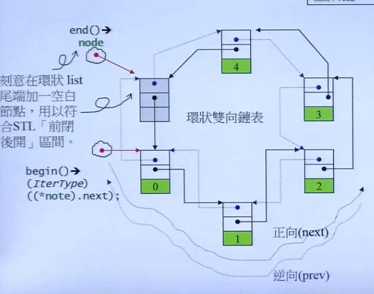
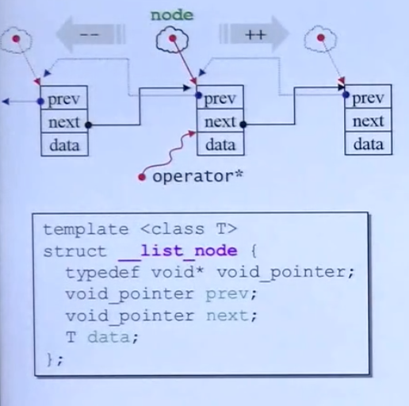
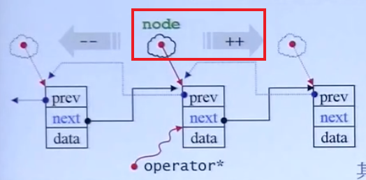

## Day 1 小试牛刀

本次任务对应的代码为 [gcc/libstdc++-v3/include/bits/stl_list.h at releases/gcc-9 · gcc-mirror/gcc · GitHub](https://github.com/gcc-mirror/gcc/blob/releases/gcc-9/libstdc%2B%2B-v3/include/bits/stl_list.h)


C++ 标准库不等于 STL。C++ 标准库是 C++ Standard Library, 而 STL 是 Standard Template Library 标准模板库。STL 是 C++ 标准库的子集，包含六大部分和其周边。

标准库以 header file 形式呈现。C++ 标准库的 header files 不带后缀 .h, 例如 # include \<vector>  新式 C header files 也不带 .h 例如 # include \<cstdio>，旧式 C header files 带有 .h 后缀仍然可用，例如 # include \<stdio.h>

新式 headers 内的组件封装于  namespace "std" 

使用方法

```
using namespace std;
```

或者 （如果只需要导入某些特殊组件）

```
using std::out;
```

使用组件就不会用加上繁琐的 std::out 之类的东西


### STL list

容器有十几种，STL 的数组有 array 与 vector，不过最容易上手的还是 list。

list 是一个环状双向链表。



为了实现一个“智能的”双向链表，iterator 需要连续迭代地运行，也就是说，在我取到 prev pointer 的时候，我可以读取到其对应节点的 next pointer 的值，然后取出 next pointer 指向的指针。

所以我们的 iterator 需要用一个类来定义。为了供应给所有的使用者，所有的容器都必须要有一个 typedef。（虽然在这里不太理解是为什么，因为自己所理解的 typedef 就是 struct 类中的，回去查一下吧。我的理解是，iterator 就是一个用于创建 \__list\_iterator 的模板类


后面发现确实是 struct 的（） 不过自己觉得还是需要去复习一下。

对于 \__list_iterator 结构体的定义

```c++
template<class T, class Ref, class Ptr>
struct __list_iterator {
	typedef T value_type;
	typedef Ptr pointer;
	typedef Ref reference;
}
```



于是我们可以完整地实现出 \__list\_iterator 结构体

```c++
template<class T, class Ref, class Ptr>
struct __list_iterator {
  typedef __list_iterator<T, Ref, Ptr> self;
  typedef bidirectional_iterator_tag iterator_category;
  typedef T value_type;
  typedef Ptr pointer;
  typedef Ref reference;
  typedef __list_node<T>* link_type;
  typedef ptrdiff_t difference_type;
  
  link_type node;
  
  reference operator*() const {return (*node).data;}
  reference operator->() const {return &(operator*());}
  self & operator++()
  {node = {link_type}((*node).next); return *this}
  self operator++(int)
  {self tmp = *this; ++*this; return tmp;}
}
```

为了区分 ++i(prefix form) 与 i++(postfix form)，C++ 中定义，operator++() 表示 prefix form, 而 operator++(int) 表示 postfix form(带参数)。

解读代码：

```c++
self & operator++()
  {node = {link_type}((*node).next); return *this}
```

node 是一个指针，这段代码的作用是把 node 里面的 next 指针取出来，当成一个值返回给node。

这样就实现了node 的++



```c++
self operator++(int)
  {self tmp = *this; ++*this; return tmp;}
```

记录原值：`self tmp = *this`

进行操作：`++*this`

返回原值：`return tmp`

这里在原视频25分钟的时候，还没有太看懂，回过去再看看吧


星号的用意：取出data


箭头的用意，就是一个对于一个`指针指向的地方的值` 进行操作，而星号的操作对象是一个结构体而不是指针。