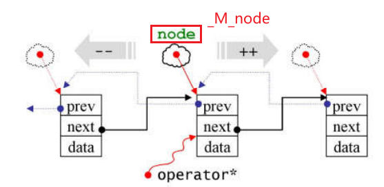
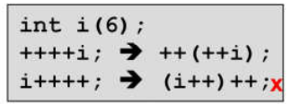

# list

源码：https://github.com/gcc-mirror/gcc/blob/releases/gcc-4.9/libstdc++-v3/include/bits/stl_list.h#L81

参考侯捷老师的课程、插图来源：https://www.bilibili.com/video/BV1wh4y1o7e9/?p=14&spm_id_from=333.1007.top_right_bar_window_history.content.click&vd_source=0d00fb4c5464c5c00d00e5815bfaf112

UML绘制：https://online.visual-paradigm.com/cn/diagrams/features/uml-tool/


[toc]

### 源码结构


**链表节点**     `_List_node`, 继承自`_List_node_base`.

**链表**            `list`,  继承自`_List_base`

**迭代器 **       `_List_iterator` 结构体

### 迭代器的设计

几乎所有容器都有自己的iterator。

迭代器相当于一个泛化的指针。

但是当我们想要对链表的指针做加一（减一）操作，实际上是想得到next（prev）节点，而不是当前节点的下一个(前一个)地址。所以在迭代器的实现中要重载各种运算符。

以`++`为例：




```C++
      _List_iterator() _GLIBCXX_NOEXCEPT  // 构造函数，_M_node初始化为空指针
      : _M_node() { }

// postfix form, i++, int参数是占位符
	  _Self
      operator++(int) _GLIBCXX_NOEXCEPT
      {
	_Self __tmp = *this;   // 记录原值
	_M_node = _M_node->_M_next;  // 前进一个节点
	return __tmp;  // 返回原值
      }

// prefix form, ++i, 
      _Self&
      operator++() _GLIBCXX_NOEXCEPT
      {
	_M_node = _M_node->_M_next;  // 取出_M_node所指向的节点里的next指针，赋给_M_node本身，相当于让_M_node指向下一个节点
	return *this;
      }

	...
// The only member points to the %list element.
      __detail::_List_node_base* _M_node;
```

- 其中`_GLIBCXX_NOEXCEPT`表示不会抛出异常

```C++
#define _GLIBCXX_NOEXCEPT noexcept
```

- 源代码将` _M_node`这个唯一的成员变量的定义放在最后，这是一种编程风格。这个变量指向一个链表节点，是一个指针，大小应该是8。

- 合理推测`--`操作就是让`_M_node`指向`prev`

- 前加加的返回值是引用，而后加加的返回值不是引用，是为了统一C++中`++`的用法：

  

对迭代器取`*`是想取出里面的data，而不是一个节点。所以对\*也要重载

```C++
	  typedef _List_node<_Tp>			_Node;      
	  typedef _Tp&				reference;
	  typedef _Tp*				pointer;	
// Must downcast from _List_node_base to _List_node to get to value.
      reference
      operator*() const _GLIBCXX_NOEXCEPT
      { return *static_cast<_Node*>(_M_node)->_M_valptr(); }

      pointer
      operator->() const _GLIBCXX_NOEXCEPT
      { return static_cast<_Node*>(_M_node)->_M_valptr(); }
	...
// The only member points to the %list element.
      __detail::_List_node_base* _M_node;
```
```C++
_Tp*       _M_valptr()       { return _M_storage._M_ptr(); }
```
`static_cast`将 `_M_node` 转换为 `_Node*` 类型，这是链表节点的指针类型。接下来，通过访问 `_M_valptr()`，它将得到指向当前节点中的值的指针，值的类型是`_Tp`。因为函数返回引用类型，所以\* 作用于这个`_Tp`变量。`->`重载将\*去掉即可。


### 节点设计

```c++
  /// An actual node in the %list.
  // 模板结构体 _List_node的定义, 根据编译器支持的C++标准版本使用不同的方式来存储节点数据
template <typename _Tp>  // _Tp is data type
struct _List_node: public __detail::_List_node_base  // derived from _List_node_base
{
      // condition lines, choose a way to compiling
#if __cplusplus >= 201103L  // 如果编译器支持 C++11 及以上的标准版本
      __gnu_cxx::__aligned_membuf<_Tp> _M_storage;
      _Tp*       _M_valptr()       { return _M_storage._M_ptr(); }
      _Tp const* _M_valptr() const { return _M_storage._M_ptr(); }
#else
      _Tp _M_data;
      _Tp*       _M_valptr()       { return std::__addressof(_M_data); }
      _Tp const* _M_valptr() const { return std::__addressof(_M_data); }
#endif
};
```


### 链表设计

unfinished...


## 收获&复习

1. uml 图。https://www.bilibili.com/video/BV1P741127u7/?vd_source=0d00fb4c5464c5c00d00e5815bfaf112

2. C++ 继承语法、访问修饰符

   > C++ 继承语法：
   >
   > ```C++
   > class derived-class: access-specifier base-class
   > ```

3. noexcept 关键字。在 C++ 中，使用 `noexcept` 关键字可以标记一个函数为不抛出异常的函数。

4. 运算符重载。

   > 重载的运算符本质上是**函数**，函数名是由关键字 operator 和其后要重载的运算符符号构成的。与其他函数一样，重载运算符有一个返回类型和一个参数列表。

5. 构造函数。

6. C++引用。https://www.runoob.com/cplusplus/cpp-references.html

   > 试想变量名称是变量附属在内存位置中的标签，您可以把引用当成是变量附属在内存位置中的第二个标签。因此，您可以通过原始变量名称或引用来访问变量的内容。例如：
   >
   > ```C++
   > int i = 17;
   > // 我们可以为 i 声明引用变量:
   > int&  r = i;  // "r 是一个初始化为 i 的整型引用"
   > ```

7. static_cast。https://www.cnblogs.com/QG-whz/p/4509710.html

   > static_cast是一个强制类型转换操作符。强制类型转换，也称为显式转换，C++中强制类型转换操作符有static_cast、dynamic_cast、const_cast、reinterpert_cast四个。
   >
   > - 编译器隐式执行的任何类型转换都可以由static_cast来完成，比如int与float、double与char、enum与int之间的转换等。
   >
   >   ```C++
   >   double a = 1.999;
   >   int b = static_cast<double>(a); //相当于a = b ;
   >   ```
   >   - 把精度大的类型转换为精度小的类型，static_cast使用位截断进行处理。
   >   使用static_cast可以找回存放在void\*指针中的值。
   >   ```C++
   >    double a = 1.999;
        void * vptr = & a;
        double * dptr = static_cast<double*>(vptr);
        cout<<*dptr<<endl;//输出1.999  
   >   ```

8. STL的容器，都遵循前闭后开区间。STL的容器都有begin()和end()。begin()指向容器首元素，而end()指向容器最后一个元素的下一个元素。
9. C++ 类的大小。https://www.cnblogs.com/ZY-Dream/p/10016731.html


## 验证&测试（unfinished）

1. 如果用sizeof取一个链表大小，结果应该是？https://github.com/gyfffffff/whale-starry/blob/main/stl/stari/gyfffffff/src/task_1/test1_1.cpp

2. 可以将成员变量的声明放在最后，即先使用后声明。https://github.com/gyfffffff/whale-starry/blob/main/stl/stari/gyfffffff/src/task_1/test1_2.cpp
3. iterator 的_M_node元素大小是8B。
4. 验证list 是双向环状链表。

### 感受

我觉得在一天之内学完所有源码是不现实的，对我来说至少。但是意义不在于全部理解这些源码，而是在于以后面对源码不会再有畏难心理，而且即使只是读一小段代码就已经收获良多了。