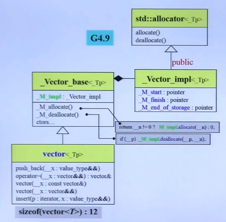

# Vector 源码学习




- 用三个指针定义一个vector：

   pointer _M_start;

   pointer _M_finish;

   pointer _M_end_of_storage;

- 指针连续存放，放满之后二倍增长

## vector 成员方法

- 构造1：构造一个没有元素的vector。vector()

- 构造2：n个默认元素的vector。

- 构造3：n个指定元素。

- 构造4：复制另一个vector。

- 构造5：初始化列表构建。vector1={，，，，}

- 构造6：从一个范围构建。

- begin: 取start指针

- end：取finish指针

- size：finish指针-start指针

- resize: 多退少补

- empty: begin==end？

- []重载：[n]将返回start+n 的指针指向的数据，没有越界检查。

- push_back: 检查finish是否和end of storage重合，如果没有，在finish处写入指定数据，并增加finish的值；如果重合，调用 _M_emplace_back_aux二倍增长。

- emplace_back：当元素是结构体时，支持对结构体元素的快速构造：

  ```C++
  struct a{
      int val=2;
      a() {};
      a(int val1, int val2) {val = val2;}
  };
  int main(){
      a A1;
      a A2;
      std::vector<a> v1 = {A1, A2};
      v1.emplace_back(2,3);  // 调用了第二个构造函数，并将构造的元素插入最后
      return 0;
  }
  ```

- clear：vector元素个数清零。

## 迭代器

因为连续容器，迭代器就是一个指针。


vector比较简单，主要时间用于自己实现一个vector。