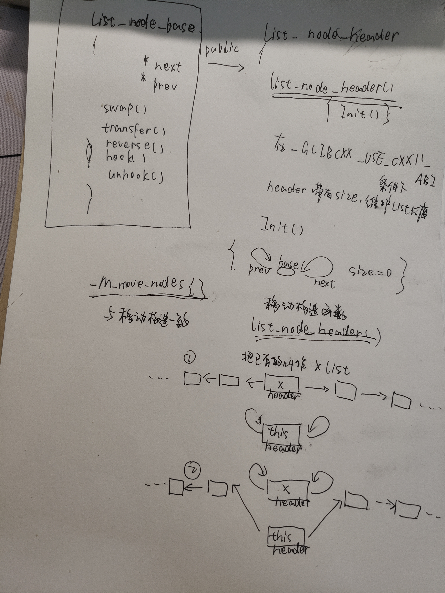
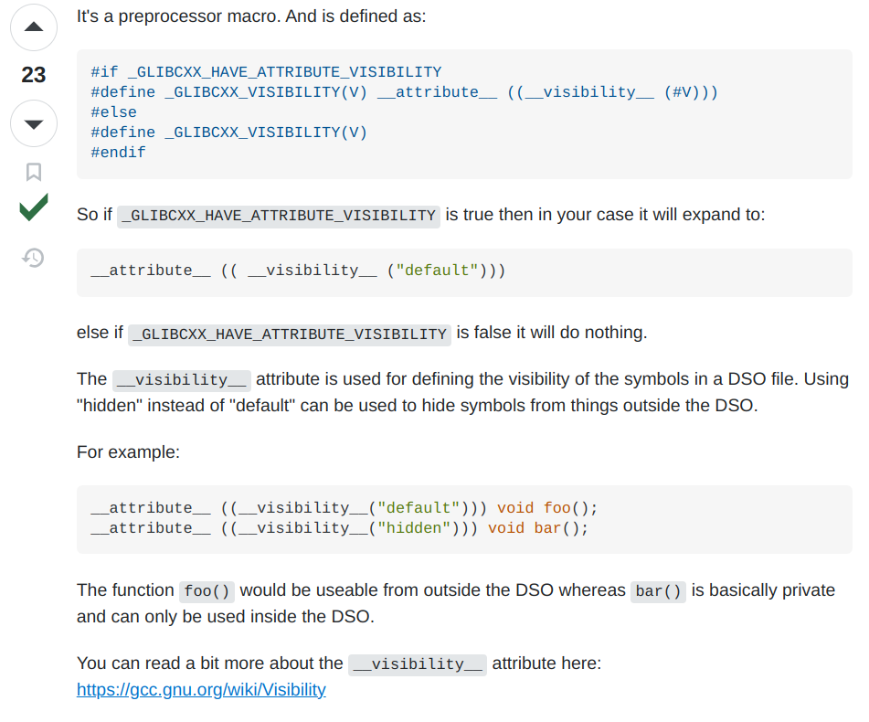

## 一点粗糙的理解


## 构建技巧
在类的内部使用typedef，如
```cpp
struct _List_iterator
    {
      typedef _List_iterator<_Tp>		_Self;
      typedef _List_node<_Tp>			_Node;

      typedef ptrdiff_t				difference_type;
      typedef std::bidirectional_iterator_tag	iterator_category;
      typedef _Tp				value_type;
      typedef _Tp*				pointer;
      typedef _Tp&				reference;
      //......
    }
```


## 命名空间
```cpp
#include<iostream>
class B{
 .....
}
int main(){
.....
}
```
B在Global命名空间中，如果想要精确地使用B，可以采用`::B`的方式

在大项目构建中，名字很有可能重复，命名空间的使用使得编程者可以精确地使用变量。


## 奇怪的_GLIBCXX_VISIBILITY

from [StackOverflow@David Saxon](https://stackoverflow.com/questions/29270208/what-is-glibcxx-visibility)


## 为何有如此多的NOEXCEPT
在STL中大多数容器类型都会在调整容器大小（resize）时调用容器元素的移动构造函数来移动资源，但STL为了保证容器类型的内存安全，在大多数情况下只会调用被标记为不会抛出异常的移动构造函数，否则会调用其拷贝构造函数来作为替代。这是因为在资源的移动过程中如果抛出了异常，那么那些正在被处理的原始对象数据可能因为异常而丢失，而在拷贝构造函数中，由于进行的是资源拷贝操作，原始数据不会被更改，因此即使抛出异常也不会影响数据最终的正确性。


## 版本适配

```cpp
#if _GLIBCXX_USE_CXX11_ABI
      std::size_t _M_size;
#endif

      _List_node_header() _GLIBCXX_NOEXCEPT
      { _M_init(); }

#if __cplusplus >= 201103L
      _List_node_header(_List_node_header&& __x) noexcept
      : _List_node_base{ __x._M_next, __x._M_prev }
# if _GLIBCXX_USE_CXX11_ABI
      , _M_size(__x._M_size)
# endif
      {
		if (__x._M_base()->_M_next == __x._M_base())
		  this->_M_next = this->_M_prev = this;
		else
		  {
		    this->_M_next->_M_prev = this->_M_prev->_M_next = this->_M_base();
		    __x._M_init();
		  }
	  }
```

如果既满足`_GLIBCXX_USE_CXX11_ABI`又满足`__cplusplus >= 201103L`，则代码应该如下：
```cpp
      std::size_t _M_size;

      _List_node_header() _GLIBCXX_NOEXCEPT  // 默认构造函数
      { _M_init(); } 


      _List_node_header(_List_node_header&& __x) noexcept // 移动构造函数
      : _List_node_base{ __x._M_next, __x._M_prev }, _M_size(__x._M_size)
      {
		if (__x._M_base()->_M_next == __x._M_base())
		  this->_M_next = this->_M_prev = this;
		else
		  {
		    this->_M_next->_M_prev = this->_M_prev->_M_next = this->_M_base();
		    __x._M_init();
		  }
	  }
```


## 迭代器就是指针
```cpp
      explicit
      _List_iterator(__detail::_List_node_base* __x) _GLIBCXX_NOEXCEPT
      : _M_node(__x) { }
```

## Downcast?
```cpp
      typedef _Tp&				reference;
      // Must downcast from List_node_base to _List_node to get to value.
      reference
      operator*() const _GLIBCXX_NOEXCEPT
      { return *static_cast<_Node*>(_M_node)->_M_valptr(); }      
```

## 迭代器的运算为何只有++，--？
以前我写过这样的代码`it+=2`，试图在`for`循环中隔一个输出一个，结果失败了。
可以看到,list的源码中，并没有重载 `+=` 这个符号

