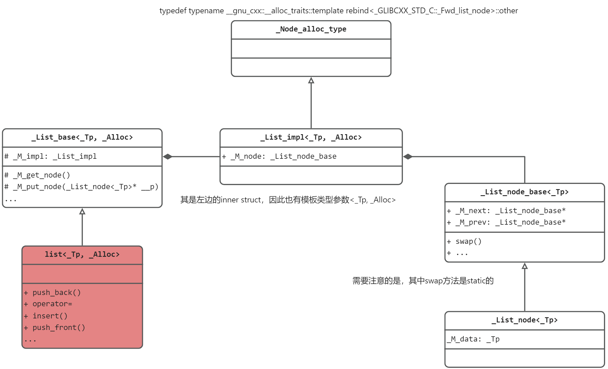

## GCC4.9源码刨析 —— list

### list class UML


> ❗Note: `list`中包含的是`_List_impl`，其只有一个成员变量`_List_node_base`，需要注意的是该结构体与真正存储数据的节点(`_List_node`)还不太一样，其只有 前向指针(`_M_prev`) 和 后继指针(`_M_next`)，可以将其看成一个`dummy node`
>    - `list` 非双向循环链表，仅仅是双向链表（虽然实际上可以，但语义上不允许）
>    - `_List_node_base` 等同于 `list.end()`，用于保证容器整体区间的 **左闭右开** 的特性

### list 特殊方法/性质

1. `list`拥有内置的`sort`方法，因此对`list`排序时不要使用算法库中的`sort`，而是采用内置的`sort`
    - 查看`算法库中sort`源码可以发现，适用该算法的容器需要拥有`RandomAccessIterator`
    - `list`提供的迭代器类型是双向迭代器`Bidirectional iterators`

2.  由于`list`的特性：每个节点都是独立的空间，之间采用 前向指针(`_M_prev`) 和 后继指针(`_M_next`) 连接起来，因此在插入(`insert`)和接合操作(`splice`)之后，都不会造成原迭代器失效。因此在插入和接合操作之后，节点的相对位置不会发生变化，原有的迭代器仍然可以正常访问。

3. STL 中的接合操作（splice）是指将两个容器中的元素进行合并或移动的操作。***它可以在常数时间内完成，不需要对元素进行复制或移动，并且可以保持容器中元素的顺序和稳定性*** \
  具体来说，接合操作可以分为两种：
    - 链表之间的接合: 即将一个 list 中的元素插入到另一个 list 中。这个操作可以通过 list 类型的成员函数 splice 来实现。splice 函数有两个版本：
      ```c++
      // 将 x 容器中 [first, last) 范围内的元素插入到当前容器中 position 位置之前
      void splice (iterator position, list& x, iterator first, iterator last);

      // 将 x 中所有元素移动到 position 之前
      void splice (iterator position, list&& x);
      ```

    - 同一链表内部的接合: 则是将链表中的某个范围内的元素移动到链表中的另一个位置。这个操作可以通过 list 类型的成员函数 splice 来实现。
      ```c++
      // splice
      list<int> l{1, 2, 3, 4, 5};
      auto it = l.begin();
      // std::advance(it, n): 将迭代器it往后移动n个位置
      std::advance(it, 2); // it 指向元素 3
      auto last = it;
      std::advance(last, 2); // last 指向元素 5
      // 即将元素{3,4} 移动到最开始，最终l = {3, 4, 1, 2, 5}
      l.splice(l.begin(), l, it, last); // 将 [it, last) 范围内的元素移动到链表头部
      ```
    - `forward_list`中对应的是`splice_after`函数，而非`splice`，且其***只支持 链表之间 的接合***

### list iterator
```c++
template<typename _Tp>
struct _List_iterator
{
  typedef _List_iterator<_Tp>                _Self;
  typedef _List_node<_Tp>                    _Node;

  // ⭐ Iterator trait: With the following five elements
  typedef ptrdiff_t                          difference_type;
  typedef std::bidirectional_iterator_tag    iterator_category;
  typedef _Tp                                value_type;
  typedef _Tp*                               pointer;
  typedef _Tp&                               reference;

  _List_iterator() _GLIBCXX_NOEXCEPT
  : _M_node() { }

  explicit
  _List_iterator(__detail::_List_node_base* __x) _GLIBCXX_NOEXCEPT
  : _M_node(__x) { }

  _Self
  _M_const_cast() const _GLIBCXX_NOEXCEPT
  { return *this; }

  // ⭐ Must downcast from _List_node_base to _List_node to get to _M_data.
  reference
  operator*() const _GLIBCXX_NOEXCEPT
  { return static_cast<_Node*>(_M_node)->_M_data; }

  pointer
  operator->() const _GLIBCXX_NOEXCEPT
  { return std::__addressof(static_cast<_Node*>(_M_node)->_M_data); }

  // prefix form(前置形式)
  _Self&
  operator++() _GLIBCXX_NOEXCEPT
  {
    _M_node = _M_node->_M_next;
    return *this;
  }

  // postfix form(后置形式)
  _Self
  operator++(int) _GLIBCXX_NOEXCEPT
  {
    // Call the copy constructor, not operator*() function! 
    // and `*this` is param of copy constructor
    _Self __tmp = *this;        
    _M_node = _M_node->_M_next;
    return __tmp;
  }

  // prefix form(前置形式)
  _Self&
  operator--() _GLIBCXX_NOEXCEPT
  {
    _M_node = _M_node->_M_prev;
    return *this;
  }

  // postfix form(后置形式)
  _Self
  operator--(int) _GLIBCXX_NOEXCEPT
  {
    // like operator++(int)
    _Self __tmp = *this;
    _M_node = _M_node->_M_prev;
    return __tmp;
  }

  bool
  operator==(const _Self& __x) const _GLIBCXX_NOEXCEPT
  { return _M_node == __x._M_node; }

  bool
  operator!=(const _Self& __x) const _GLIBCXX_NOEXCEPT
  { return _M_node != __x._M_node; }

  // The only member points to the %list element.
  // ⭐ 实际上list中有两种类型的节点： `_List_node_base(dummy head)` + `_List_node`
  // 但是它们之间是继承关系，因此可以用父类指针来指向子类对象(runtime 多态)
  __detail::_List_node_base* _M_node;
};
```

